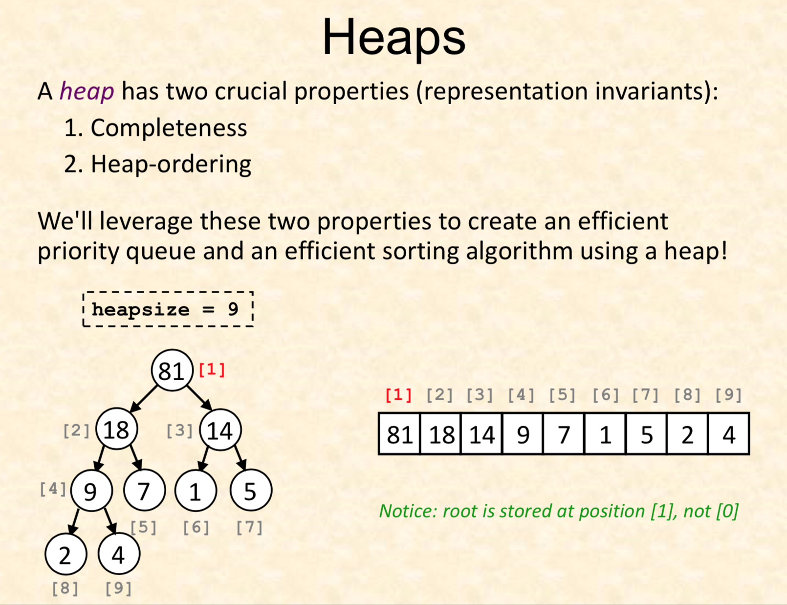

- [Algorithm Template](#algorithm-template)
  - [DFS](#dfs)
  - [BFS](#bfs)
  - [Uniont Find](#uniont-find)
  - [Heap 实现](#heap-%E5%AE%9E%E7%8E%B0)
  - [Hash Map 实现](#hash-map-%E5%AE%9E%E7%8E%B0)
  - [Quick sort](#quick-sort)
  - [Merge sort](#merge-sort)
  - [Insertion sort](#insertion-sort)
  - [Bubble sort](#bubble-sort)
  - [Selection sort](#selection-sort)
  - [Counting Sort](#counting-sort)
  - [topological sort](#topological-sort)
  - [Mono stack](#mono-stack)
  - [Mono queue](#mono-queue)
  - [Trie - Prefix Tree](#trie---prefix-tree)
  - [Tree Traverse](#tree-traverse)
    - [Inorder](#inorder)
    - [Preorder](#preorder)
    - [Postorder](#postorder)
  - [Boyer-Moore Voting Algorithm](#boyer-moore-voting-algorithm)

# Algorithm Template

## DFS

- Using recursive
  - LC 200 Number of Islands
  - reduce the code size

```c++
class Solution {
public:
    
    int total=0;
    void dfs(vector<vector<int>> & visited, vector<vector<char>>& grid, int start_i, int start_j){
        int m = grid.size();
        int n = grid[0].size();
        // boarder check is the stop recurse condition
        if(start_i <0 || start_j < 0 || start_i >= m || start_j >= n)
            return;
        if(visited[start_i][start_j]==1 || grid[start_i][start_j]=='0')
            return ;
        visited[start_i][start_j]=1;
        dfs(visited, grid, start_i +1, start_j +0);
        dfs(visited, grid, start_i -1, start_j + 0);
        dfs(visited, grid, start_i + 0, start_j + 1);
        dfs(visited, grid, start_i + 0 , start_j -1);
    }
    
    int numIslands(vector<vector<char>>& grid) {
        if(grid.empty())
            return 0;
        int m = grid.size();
        int n = grid[0].size();
        vector<vector<int>> visited(m, vector<int>(n,0));
        for(int i=0;i<m;i++){
            for(int j=0;j<n;j++){
                if(grid[i][j]=='1' && visited[i][j]==0){
                    total++;
                    dfs(visited, grid, i, j);
                }
            }
        }
        return total;
    }
};

```

- Using traditional Stack
    LC 200 Number of Island

```c++
class Solution {
public:
    
    int total=0;
    vector<int> dir_i = {0,-1,1,0};
    vector<int> dir_j = {1,0,0,-1};
     
    void dfs(vector<vector<int>> & visited, vector<vector<char>>& grid, int start_i, int start_j){
        int m = grid.size();
        int n = grid[0].size();
        if(visited[start_i][start_j]==1)
            return;
        total++;
        stack<pair<int,int>> my_stack;
        my_stack.push(make_pair(start_i, start_j));
        visited[start_i][start_j] = 1;
        while(!my_stack.empty()){
            pair<int,int> cur = my_stack.top();
            my_stack.pop();
            for(int k=0;k<4;k++){
                int new_i = cur.first + dir_i[k];
                int new_j = cur.second + dir_j[k];
                if(new_i>=0 && new_j >=0 && new_i < m && new_j < n && visited[new_i][new_j] == 0 && grid[new_i][new_j]=='1'){
                    visited[new_i][new_j] = 1;
                    my_stack.push(make_pair(new_i, new_j));
                }
                
            }
        }
    }
    
    int numIslands(vector<vector<char>>& grid) {
        if(grid.empty())
            return 0;
        int m = grid.size();
        int n = grid[0].size();
        vector<vector<int>> visited(m, vector<int>(n,0));
        for(int i=0;i<m;i++){
            for(int j=0;j<n;j++){
                if(grid[i][j]=='1'){
                    dfs(visited, grid, i, j);
                }
            }
        }
        return total;
    }
};
```

## BFS

Tricks in BFS
LC Level order traversal
```c++
struct TreeNode{
    int value;
    TreeNode* left;
    TreeNode* right;
    TreeNode(int val) : value(val), left(nullptr), right(nullptr){}
    TreeNode() : value(0), left(nullptr), right(nullptr){}
};
void bfs(TreeNode* root){
    vector<TreeNode*> bfs_vector;
    bfs_vector.push_back(root);
    for(int i=0;i<bfs_vector.size();i++){
        if(bfs_vector[i]->left!=nullptr)
            bfs_vector.push_back(bfs_vector[i]->left);
        if(bfs_vector[i]->right!=nullptr)
            bfs_vector.push_back(bfs_vector[i]->right);  
    }
}

```


- Using Traditional Queue
    LC 200 Number of Island

```c++
class Solution {
public:
    
    int total=0;
    vector<int> dir_i = {0,-1,1,0};
    vector<int> dir_j = {1,0,0,-1};
     
    void bfs(vector<vector<int>> & visited, vector<vector<char>>& grid, int start_i, int start_j){
        int m = grid.size();
        int n = grid[0].size();
        if(visited[start_i][start_j]==1)
            return;
        total++;
        deque<pair<int,int>> dq;
        dq.emplace_back(start_i,start_j);
        visited[start_i][start_j] = 1;
        while(!dq.empty()){
            pair<int,int> cur = dq.front();
            dq.pop_front();
            for(int k=0;k<dir_i.size();k++){
                int new_i=cur.first + dir_i[k];
                int new_j=cur.second + dir_j[k];
                if(new_i>=0 && new_j>=0 && new_i < m && new_j < n && visited[new_i][new_j]==0 && grid[new_i][new_j]=='1'){
                    dq.emplace_back(new_i, new_j);
                    visited[new_i][new_j]=1;
                }
                
            }
        }
        
    }
    
    int numIslands(vector<vector<char>>& grid) {
        if(grid.empty())
            return 0;
        int m = grid.size();
        int n = grid[0].size();
        vector<vector<int>> visited(m, vector<int>(n,0));
        for(int i=0;i<m;i++){
            for(int j=0;j<n;j++){
                if(grid[i][j]=='1'){
                    bfs(visited, grid, i, j);
                }
            }
        }
        return total;
    }
};

```


## Uniont Find

- Union find with path compression
    LC 200 Number of Islands
```c++
class Solution {
public:
    
    int total;

    int find(vector<int>& rep, int index){
        if(rep[index]!=index){
            // assign is the key with path compression;
            rep[index]=find(rep,rep[index]);
        }
        return  rep[index];
    }
    
    void self_union(vector<int> & rep, int index1, int index2){
        int root1 = find(rep, index1);
        int root2 = find(rep, index2);
        if(root1==root2)
            return;
        rep[root2] = root1;
        // union one time means the total number of islands decrement 1
        total--;
    }
    
    vector<int> dir_x = {1,0};
    vector<int> dir_y = {0,1};
    
    int numIslands(vector<vector<char>>& grid) {
        if(grid.empty()){
            return 0;
        }
        int m = grid.size();
        int n = grid[0].size();

        vector<int> rep_map(m*n,0);
        total = m*n;
        iota(rep_map.begin(), rep_map.end(), 0);
        for(int i=0;i<m;i++){
            for(int j=0;j<n;j++){
                if(grid[i][j]=='0'){
                    total--;
                    continue;
                }
                for(int k=0;k<dir_x.size();k++){
                    int new_x = dir_x[k] + i;
                    int new_y = dir_y[k] + j;
                    if(new_x >=0 && new_y >=0 && new_x < m && new_y < n && grid[new_x][new_y]=='1'){
                        self_union(rep_map, i*n+j, new_x*n+new_y);
                    }
                }
            }
        }
        
        return total;
    }
};

```

## Heap 实现


- Access parent of kth element: array[k/2]
- Access left_child of kth element: array[2*k]
- Access right child of kth element: array[2*k+1]

Heap stores the complete binary tree into array. The heap has following operations: push(), pop().

- Push: add element to the end of array, and fix the heap order
- Pop: replace the element on the top with element, and fix the heap order

```c++
template<class Item>
class Heap{

public:
    Item[] heap;
    int _heap_size;
    Heap(int heap_size) : _heap_size(heap_size){ } 
    Heap() : _heap_size(100) {}
    void push(Item newItem) {
        heap[++heapsize] = newItem; 
        fixUp(heap, heapsize);
    }
    // fix the order of kth elements in array
    void fixUp(Item[] heap, int k){
        while(k>1 && heap[k/2] < heap[k] ){
            swap(heap[k], heap[k/2]);
            k /= 2;
        }
    }

    void pop(){
        heap[1] = heap[heap_size--];
        fixDown(heap, 1);
    }

    void fixDown(Item[] heap, int heap_size, int k){
        while(2*k<=heap_size){
            int j=2*k;// start with left child
            // find which child is greater
            if(j<heap_size && heap[j] < heap[j+1]) ++j;
            if(heap[k] >= heap[j]){break;} // restorr heap
            swap(heap[k], heap[j]);
            k=j;// move down
        }
    }

}


};
```

## Hash Map 实现
hash function 映射Key到address


```c++
class MyHashMap {
public:
    
    vector<list<pair<int,int>>> my_map;
    int max_size = 10000;
    
    /** Initialize your data structure here. */
    MyHashMap() {
        my_map.resize(max_size);
    }
    // hash function 在这里有很多种
    // for integer, we just mod it with the bucket size 
    int hash_func(int key){
        return key % max_size;
    }
    
    /** value will always be non-negative. */
    void put(int key, int value) {
        int hash_index = hash_func(key);
        list<pair<int,int>>::iterator iter;
        list<pair<int,int>> & link_list=my_map[hash_index];
        for(iter = link_list.begin();iter!=link_list.end();iter++){
            if((*iter).first==key){
                (*iter).second = value;
                return;
            }
        }
        link_list.emplace_back(key, value);
    }
    
    /** Returns the value to which the specified key is mapped, or -1 if this map contains no mapping for the key */
    int get(int key) {
        int hash_index = hash_func(key);
        list<pair<int,int>>::iterator iter;
        list<pair<int,int>> & link_list = my_map[hash_index];
        for(iter = link_list.begin();iter!=link_list.end();iter++){
            if((*iter).first==key){
                return (*iter).second;
            }
        }
        return -1;
    }
    
    /** Removes the mapping of the specified value key if this map contains a mapping for the key */
    void remove(int key) {
        int hash_index = hash_func(key);
        list<pair<int,int>>::iterator iter;
        list<pair<int,int>> & link_list = my_map[hash_index];
        for(iter = link_list.begin();iter!=link_list.end();iter++){
            if((*iter).first==key){
                link_list.erase(iter);
                return;
            }
        }
    }
};
```


## Quick sort

- Quick sort 实现
  - partition and sort
  - find the using a element as pivot to find it correct position in this array

```c++
class Solution {
public:
    int findKthLargest(vector<int>& nums, int k) {
        int left = 0, right = nums.size() - 1, kth;
        while (true) {
            int idx = partition(nums, left, right);
            if (idx == k - 1) {
                kth = nums[idx];
                break;
            }
            if (idx < k - 1) {
                left = idx + 1;
            } else {
                right = idx - 1;
            }
        }
        return kth;
    }
private:
    int partition(vector<int>& nums, int left, int right) {
        int pivot = nums[left], l = left + 1, r = right;
        while (l <= r) {
            if (nums[l] < pivot && nums[r] > pivot) {
                swap(nums[l++], nums[r--]);
            }
            if (nums[l] >= pivot) {
                l++;
            }
            if (nums[r] <= pivot) {
                r--;
            }
        }
        swap(nums[left], nums[r]);
        return r;
    }
};
```

## Merge sort

- Using two pointer to merge
```c++
class Solution {
public:
    void merge(vector<int>& nums1, int m, vector<int>& nums2, int n) {
        int index = m+n-1;
        int ptr1 = m-1;
        int ptr2 = n-1;
        while(ptr1 >=0 || ptr2 >=0){
            int int1 = ptr1 < 0 ? INT_MIN : nums1[ptr1];
            int int2 = ptr2 < 0 ? INT_MIN : nums2[ptr2];
            if(int1 > int2){
                nums1[index--] = int1;
                ptr1--;
            } else {
                nums1[index--] = int2;
                ptr2--;
            }
        }
    }
};
```

## Insertion sort

Most common ways
```c++
void insertion_sort(vector<int> nums){
    for(int i=1;i<nums.size();i++){
        for(int j=0;j<i;j++){
            if(nums[i]>nums[j]){
                swap(nums[j],nums[i]);
            }
        }
    }
}
```

little improvement.
```c++
void insertion_sort(vector<int> nums){
    for(int i=1;i<nums.size();i++){
        int temp = nums[i];
        int j=i;
        while(v<a[j-1]){
            // move the item back
            a[j] = a[j-1];
            j--;
        }
        a[j] = temp;
    }
}
```


## Bubble sort

Traditional bubble sort
```c++
void bubble_sort(vector<int> nums){
    for(int i=0;i<nums.size();i++){
        for(int j=nums.size()-1;j>i;j--){
            if(nums[j]>nums[j-1]){
                swap(nums[j],nums[j-1]);
            }
        }
    }

}
```

Adaptive bubble sort(if now swap happens in a round, break the loop)
```c++
void adap_bubble_sort(vector<int> nums){
    for(int i=0;i<nums.size();i++){
        bool swapped = false;
        for(int j=nums.size()-1;j>i;j--){
            if(nums[j]>nums[j-1]){
                swapped = true;
                swap(nums[j],nums[j-1]);
            }
        }
        if(!swapped){
            break;
        }
    } 
}
```

## Selection sort
Find the smalled element and swap with first.
```c++
void selection_sort(vector<int> nums){
    for(int i=0;i<nums.size();i++){
        int cur_min_idx=i;
        for(int j=i+1;j<nums.size();j++){
            if(nums[j] < nums[cur_min_idx]){
                cur_min_idx = j;
            }
        }
        if(cur_min_idx != i){
            swap(nums[cur_min_idx], nums[i]);
        }
    }
}
```

## Counting Sort
For array's only have limited kinds of values. We can use the counting sort / bucket sort.

```c++

// nums: A B A R S D Q A S
void bucket_sort(vector<char> chars){
    vector<char> bucket;
    // put items into buckets
    for(auto &x : chars){
        bucket[x]++;
    }
    int cur = 0;
    for(int i=0;i<26;i++){
        for(int j=0;j<bucket[i];j++){
            chars[cur++] = i+'A';
        }
    }

}

```

## topological sort

Algorithm from the wikipedia:
```
L ← Empty list that will contain the sorted nodes
while there are unmarked nodes do
    select an unmarked node n
    visit(n)

function visit(node n)
    if n has a permanent mark then return
    if n has a temporary mark then stop   (not a DAG)
    mark n temporarily
    for each node m with an edge from n to m do
        visit(m)
    mark n permanently
    add n to head of L
```

Course schedule problems LC 210:

There are a total of n courses you have to take, labeled from 0 to n-1.

Some courses may have prerequisites, for example to take course 0 you have to first take course 1, which is expressed as a pair: [0,1]

Given the total number of courses and a list of prerequisite pairs, return the ordering of courses you should take to finish all courses.

There may be multiple correct orders, you just need to return one of them. If it is impossible to finish all courses, return an empty array.
```c++
class Solution {
public:


    vector<int> per_mark;
    vector<int> topo_list;

    bool visit(int n, vector<pair<int, int>>& prerequisites, vector<int> temp_mark){
        if(per_mark[n] == 1){
            return true;
        }
        if(temp_mark[n] == 1){
            return false;
        }
        temp_mark[n] = 1;
        for(int i=0;i<prerequisites.size();i++){
            if(prerequisites[i].first == n){
                if(!visit(prerequisites[i].second, prerequisites, temp_mark))
                    return false;
            }
        }
        per_mark[n] = 1;
        topo_list.push_back(n); // This is the key to record the topological order
        return true;
    }

    vector<int> findOrder(int numCourses, vector<pair<int, int>>& prerequisites) {
        per_mark = vector<int>(numCourses, 0);
        vector<int> temp_mark(numCourses, 0);
        for(int i=0;i<per_mark.size();i++){
            if(per_mark[i] == 1)
                continue;
            // Eachtime visit pass into the temperary mark
            if(!visit(i, prerequisites, temp_mark))
                return {};
        }
        return topo_list;
    
    }
};
```

## Mono stack
The mono stack is usually used to solve the next greater element or previous greater element. It maitains a monotonic order in stack;

```c++
// Find the first greater element after it for each element in array
vector<int> next_geater_ele(vector<int> nums){
    int n = nums.size();
    vector<int> nge(n,-1);//next first greater element
    stack<int> mono_stack;
    for(int i=0;i<n;i++){
        while(!mono_stack.empty() && nums[i] > nums[mono_stack.top()]){
            nge[mono_stack.top()] = i;
            mono_stack.pop();
        }
        mono_stack.push(i);
    }
    return nge;
}

vector<int> prev_greater_ele(vector<int> nums){
    int n = nums.size();
    vector<int> pge(n,-1);// prev fisrt greater element
    stack<int> mono_stack;
    for(int i=0;i<n;i++){
        while(!mono_stack.empty() && nums[i] > nums[mono_stack.top()]){
            mono_stack.pop();
        }
        pge[i]=mono_stack.top();
        mono_stack.push(i);
    }
    return nge;
}
```


## Mono queue


## Trie - Prefix Tree

```c++
// Typical Trie Node design

struct TrieNode {

    // using the is_end as a indicator of existence
    bool is_end;
    struct TrieNode* links[26];
    TrieNode() {
        is_end = false;
        for(int i=0;i<26;i++){
            links[i] = nullptr;
        }
    }
    bool containsKey(char x){
        return links[x-'a'] != nullptr;
    }
    void put(char x, TrieNode* node){
        links[x-'a'] = node;
    }

    TrieNode* get(char x){
        return links[x-'a'];
    }

    bool isEnd(){
        return is_end;
    }
    void setEnd(){
        is_end = true;
    }
};

class Trie {

public:

    TrieNode* root;

    /** Initialize your data structure here. */
    Trie() {
        root = new TrieNode();
    }
    
    /** Inserts a word into the trie. */
    void insert(string word) {
        TrieNode* node_ptr;
        node_ptr = root;
        for(int i=0;i<word.length();i++){
            if(!node_ptr->containsKey(word[i])){
                TrieNode* new_node = new TrieNode();
                node_ptr->put(word[i], new_node);
            }
            node_ptr = node_ptr->get(word[i]);
        }
        node_ptr->setEnd();
    }
    
    /** Returns if the word is in the trie. */
    bool search(string word) {
        TrieNode* node_ptr;
        node_ptr = root;
        for(int i=0;i<word.length();i++){
            if(!node_ptr->containsKey(word[i])){
                return false;
            }
            node_ptr = node_ptr->get(word[i]);
        }
        if(node_ptr->isEnd())
            return true;
        else
            return false;
    }
    
    /** Returns if there is any word in the trie that starts with the given prefix. */
    bool startsWith(string prefix) {
        TrieNode* node_ptr;
        node_ptr = root;
        for(int i=0;i<prefix.length();i++){
            if(!node_ptr->containsKey(prefix[i])){
                return false;
            }
            node_ptr = node_ptr->get(prefix[i]);
        }
        return true;
    }
};


```

## Tree Traverse

### Inorder

- Iterative
```c++
class Solution {
public:
    vector<int> inorderTraversal(TreeNode* root) {
        stack<TreeNode*> my_stack;
        vector<int> ret;
        while(root!=nullptr || !my_stack.empty()){
            while(root!=nullptr){
                my_stack.push(root);
                root = root->left;
            }
            root = my_stack.top();
            my_stack.pop();
            ret.push_back(root->val);
            root = root->right;
        }
        return ret;
    }
};
```
- recursive
```c++
class Solution {
public:
    vector<int> inorderTraversal(TreeNode* root) {
        vector<int> nodes;
        inorder(root, nodes);
        return nodes;
    }
private:
    void inorder(TreeNode* root, vector<int>& nodes) {
        if (!root) {
            return;
        }
        inorder(root -> left, nodes);
        nodes.push_back(root -> val);
        inorder(root -> right, nodes);
    }
};
```


### Preorder

- Iterative
```c++
class Solution {
public:
    vector<int> preorderTraversal(TreeNode* root) {
        stack<TreeNode*> my_stack;
        vector<int> ret;
        if(root==nullptr){
            return ret;
        }
        my_stack.push(root);
        while(!my_stack.empty()){
            TreeNode* top = my_stack.top();
            ret.push_back(top->val);
            my_stack.pop();
            if(top->right){
                my_stack.push(top->right);
            }
            if(top->left){
                my_stack.push(top->left);
            }
        }
        return ret;
    }
};
```


### Postorder

- Iterative
```c++
class Solution {
public:
    vector<int> postorderTraversal(TreeNode* root) {
        vector<int> ret;
        if(root==nullptr){
            return ret;
        }
        stack<TreeNode*> my_stack;
        my_stack.push(root);
        while(!my_stack.empty()){
            TreeNode* top = my_stack.top();
            ret.push_back(top->val);
            my_stack.pop();
            if(top->left){
                my_stack.push(top->left);
            }
            if(top->right){
                my_stack.push(top->right);
            }
        }
        return vector<int>(ret.rbegin(), ret.rend());
    }
};
```


## Boyer-Moore Voting Algorithm

- used to find the majority element

