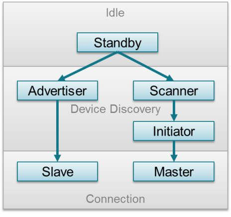

[Goback to Readme](./readme.md)

## Bluetooth Low Energy

### Overview

Bluetooth 4.2 allows two systems of wireless technology, Bluetooth Basic Rate (BR: BR/EDR for Basic Rate/Enhanced Data Rate) and Bluetooth Low Energy.

The base rate was usually applied in applications like wirelss headphones. The low engery system was created to trasmit small package of data.

The Bluetooth Low Energy protocol stack consists of host and controller.
- the controller, it consists of three parts: Host-cotroller interfaces, Link layer, and Physical layer.
- the Host, it consists fo GAP, GATT, SM, ATT, L2CAP.
- Any application or profile always sit on hte GAP and GATT layer. Usuallly we only need to take care of GAT and GATT layer.

The GAP layer control the RF state of the device, there are five RF states for a device:
- Standby
- Advertising: advertiser transmited data without connecting
- Scanning: scanner scan for the advertiser
- Initiating: innitiator is a device which respond to a advertiser 
- Connected: when connected, the device become either a master for slave. the connection initialtor is the master, the one accept the request is the slave.

The Logical Link Control and Adaptation Layer Protocol (L2CAP) layer provides data encapsulation services to the upper layers, allowing for logical end-to-end communication of data.

### GAT

#### State diagram of a device

- Standby: The device is in the initial idle state upon reset.
- Advertiser: The device is advertising with specific data letting any initiating devices know that it is a connectible device (this advertisement contains the device address and can contain some additional data such as the device name).
- Scanner: When receiving the advertisement, the scanning device sends a scan request to the advertiser. The advertiser responds with a scan response. This process is called device discovery. The scanning device is aware of the advertising device and can initiate a connection with it.
- Initiator: When initiating, the initiator must specify a peer device address to which to connect. If an advertisement is received matching that address of the peer device, the initiating device then sends out a request to establish a connection (link) with the advertising device with the connection parameters described in Connection Parameters.

#### Connection Parameter

- Connection interval is the amount of time between two connection events
-  If there is no application data to be sent or received, the two devices exchange link layer data to maintain the connection
- Slave Latency - This parameter gives the slave (peripheral) device the option of skipping a number of connection events. 
- Effective connection intervals is the interval between two successful connection event when the slave latency is specified.

### GATT

the GATT layer of the Bluetooth low energy protocol stack is used by the application for data communication between two connected devices

- The GATT server: the device containing the characteristic database that is being read or written by a GATT client.
- The GATT client: the device that is reading or writing data from or to the GATT server.

#### GATT Characteristics and Attributes

- Characteristics as groups of information called attributes
- Attributes are the information actually transferred between devices
- 
#### GATT Security