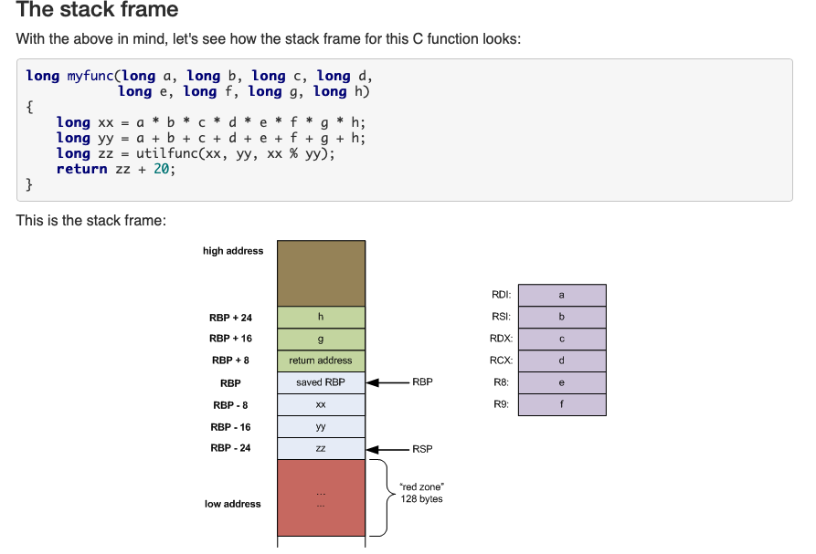
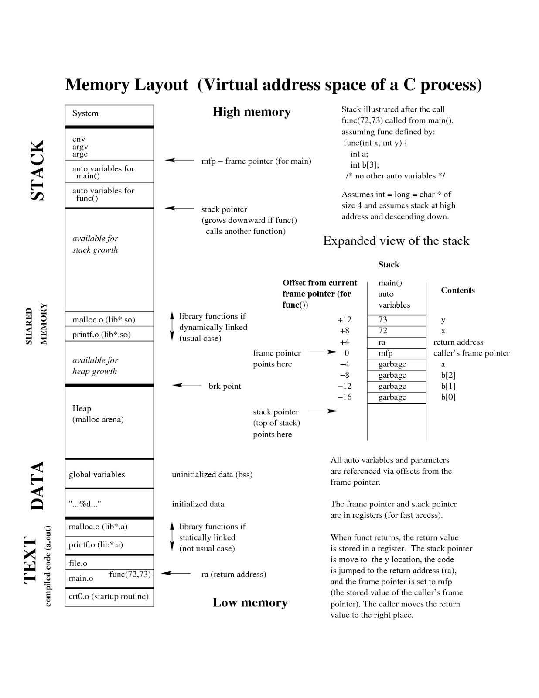

[Goback to Readme](./readme.md)

- [Compiler Construction](#compiler-construction)
  - [Lexical Analysis](#lexical-analysis)
  - [Parsing](#parsing)
  - [Type checking](#type-checking)
  - [THe last step: code generation](#the-last-step-code-generation)
  - [Program organization](#program-organization)
  - [Optmization](#optmization)

## Compiler Construction

### Lexical Analysis
It turns a stream of characters into a stream of tokends. Tokens is to define a class of word. Like in engish, we have noun, objective, verb. For programming language we have integer, string, variable and so on.

Typical, in this step, we use regular expression to match these tokens.

### Parsing
Parsing will generate the abstract syntax tree fron the tokens. Parsing using the context free language to describe the grammer.

You can think about the if expression, the root of the syntrax tree will be if_exp, the child will be the condition, codes in the if statement. else 

### Type checking
When we got the syntax tree, then we do type checking of the code. The inference rule will define the type of different expressions. Like for the if statement, the type of its conndition must be bool. For the function call the type checker will check if the type of paramter and the arguments of that function call meet the definition.

### THe last step: code generation

### Program organization

When the program is invoked, the operating system will allocate spaces for this program. The machien code will be loded into the space.

Stack frame for x86

Memory Layout

[X86 Assembly Guide](http://flint.cs.yale.edu/cs421/papers/x86-asm/asm.html)

### Optmization
In order to do optimization, we need convert the code into a intermediate representation which is convenient for us to analysis the patterns in the code.
For the dead code elimination, we only do it for assignment instruction. Through the liveness analysis, where the dead code is, and remove it from my syntax tree.