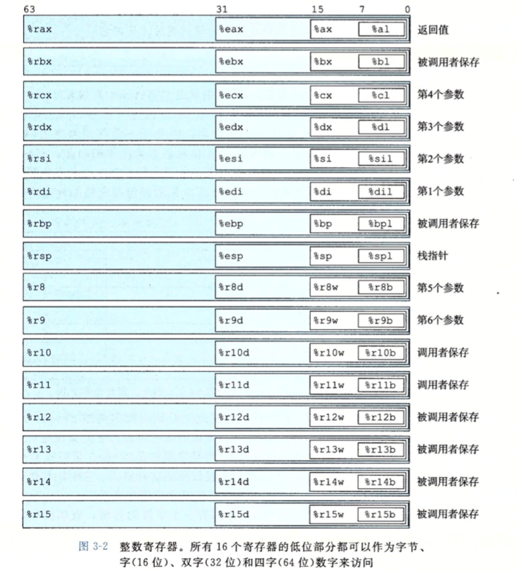
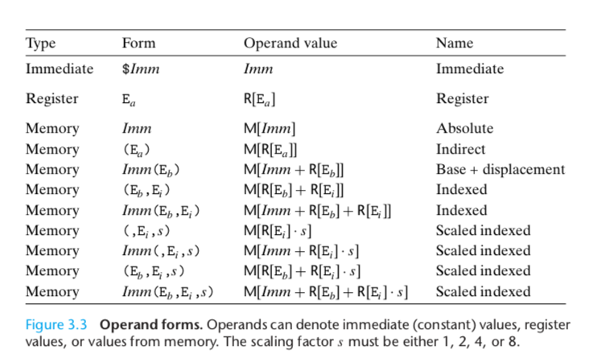
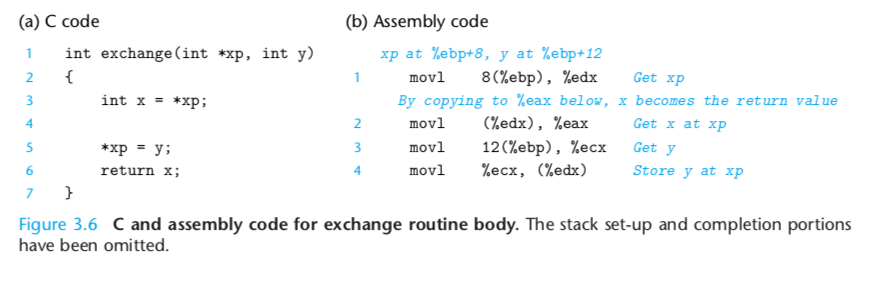

[Goback to Readme](./readme.md)

- [Compiler Construction](#compiler-construction)
  - [Lexical Analysis](#lexical-analysis)
  - [Parsing](#parsing)
  - [Type checking](#type-checking)
  - [THe last step: code generation](#the-last-step-code-generation)
  - [Program organization](#program-organization)
  - [Optmization](#optmization)

## Compiler Construction

### Lexical Analysis
It turns a stream of characters into a stream of tokends. Tokens is to define a class of word. Like in engish, we have noun, objective, verb. For programming language we have integer, string, variable and so on.

Typical, in this step, we use regular expression to match these tokens.

### Parsing
Parsing will generate the abstract syntax tree fron the tokens. Parsing using the context free language to describe the grammer.

You can think about the if expression, the root of the syntrax tree will be if_exp, the child will be the condition, codes in the if statement. else 

### Type checking
When we got the syntax tree, then we do type checking of the code. The inference rule will define the type of different expressions. Like for the if statement, the type of its conndition must be bool. For the function call the type checker will check if the type of paramter and the arguments of that function call meet the definition.

### THe last step: code generation

### Program organization

When the program is invoked, the operating system will allocate spaces for this program. The machien code will be loded into the space.

Start function call:
- If caller want to reuse some value stored in RAX RDX, it need push them into stack, and retrive them after function call
- Caller Push the arguments into stack int reverse order ( last parameter first)
- Caller Push the return adress into stack
- Callee Push old base pointer into stack (The base pointer is used to access elements int the stack by adding offset to it). It points the address manipulated by callee.
- Callee push all the local variable into the stacks
- Callee start execution its instructions

After funcion call ends:
- Callee save the return value in to RAX
- Deallocate all local variable by reset the stack pointer to base pointer
- Restore caller's base pointer value by pop it from the stack
- Execute "ret" instruction, it will find the return address from the stack.

(If we have very large argumetns or local variable, the stackoverflow will happens)

Memory Layout for 32-bit machine. The difference between 32-bit and 64-bit machine is how the size of a memeory address.

X86 has 8 general purpuse register. 
- EAX usually will be used as accumulator for alrithmetic instructions. Also it will store the return value.
- 

Tree types of operand
- Imediate
- Register
- Memory reference (access memeory location according to computed address)
  - Indirect memeory reference
  - Absolute address access
  - Base + displacement reference 
  - Scaled index reference

[X86 Assembly Guide](http://flint.cs.yale.edu/cs421/papers/x86-asm/asm.html)

Assembly Code example for exchange value. Here the machine is 32bit, if for the 64-bit machine, the xp will be movq 2*8(%ebp), %edx

### Optmization
In order to do optimization, we need convert the code into a intermediate representation which is convenient for us to analysis the patterns in the code.
For the dead code elimination, we only do it for assignment instruction. Through the liveness analysis, where the dead code is, and remove it from my syntax tree.