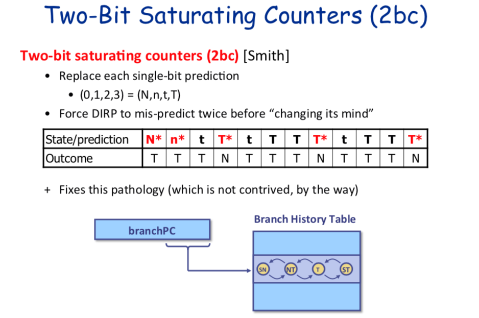
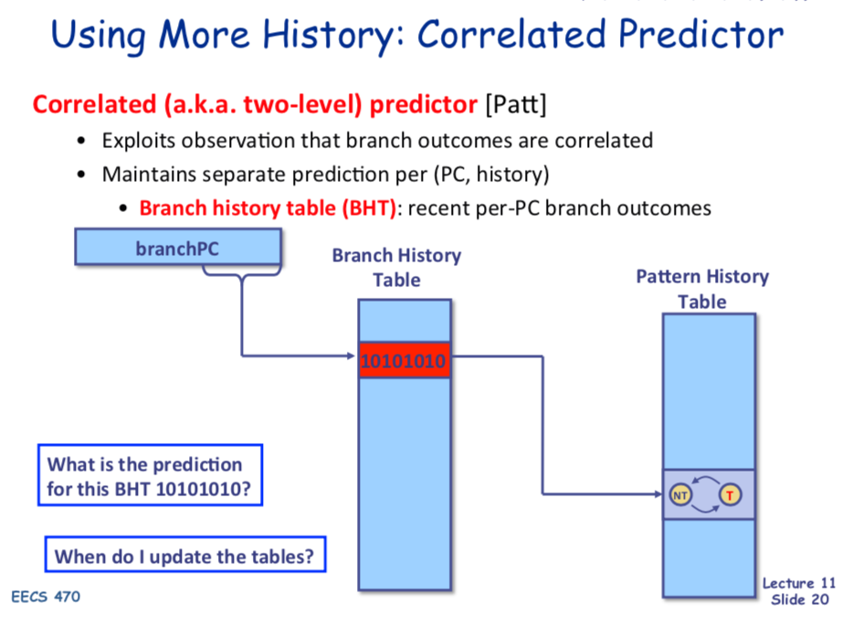

[Goback to Readme](./readme.md)

- [Computer Architecture](#computer-architecture)
  - [RISC vs CISC](#risc-vs-cisc)
  - [Pipeline](#pipeline)
  - [Hazards](#hazards)
  - [Speculating and Interrupt](#speculating-and-interrupt)
  - [MIPS R10K Style](#mips-r10k-style)
  - [Branch Prediction](#branch-prediction)
  - [Cache](#cache)
  - [Virtual Memory](#virtual-memory)

## Computer Architecture

### RISC vs CISC
- RISC(reduced instruction set)
  - it want to execture a simple instructions in a single cpu clock cycle
  - its code size is usually large

- CISC
  - it want to use instruction as few as possible to accomplish complex task
  - its code size is uaually small.
  - A instruction will go through several clock cycles

### Pipeline

5 Stages Pipeline:
- Fetch
  - Fectch instructions from the memory
- Decode
  - decode the operand and opercode
- Execute
  - perfrom ALU operation
  - calculate branch address
- Memory Operation
  - access data cache
- WriteBack
  - write the data back to destination register

R10K Pipeline Stages:
- Fetch
- Dispatch
- Issue (Issue the instructions to functional unit and execute)
- Execute 
- Complete
- Retire 

### Hazards

- Control hazards
  - Conditional branches change the instruction sequence
  - Instructions we want to execute after branches depends on the outcome of branch
- Data Hazards (Both for the memory data and regiser)
  - True dependence (RAW):
    Instruction must wait for all required input operands
  - Anti-Dependence (WAR):
    Later write must not clobber a s:ll-pending earlier read
  - Output dependence (WAW):
    Earlier write must not clobber already-completed later write

### Speculating and Interrupt 
In mordern processor, we speculative execute the branch instructions, and use the branch predictor to predict if the branch takes or not. When we predict wrong, we can roll back. So when the interrupt happens, becase we execute instructions out of order. We must have the precise state to denote that instructions before the state has been executed and instructions after it seem never started.

### MIPS R10K Style

### Branch Prediction

We usually use the branch address and branch history to predict the branch outcome
- Two bit saturating counter

- Correlated Branch predictor

### Cache

### Virtual Memory