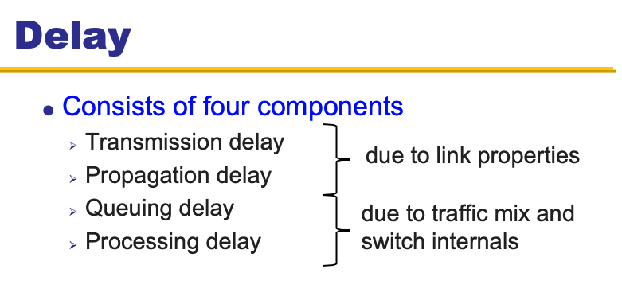
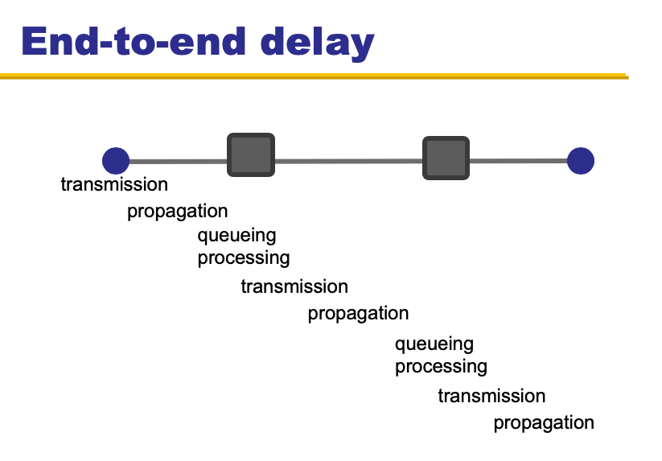
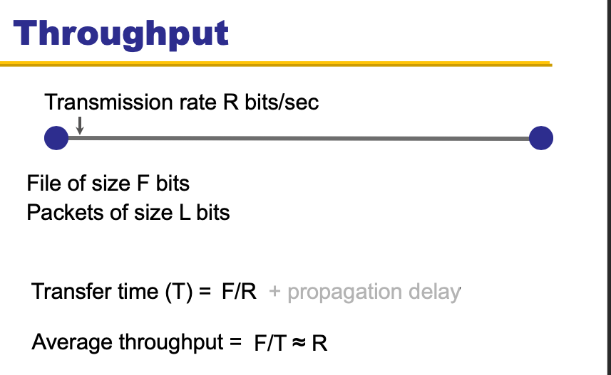
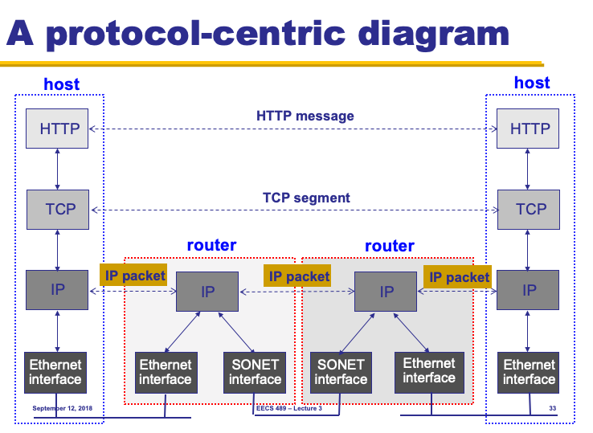
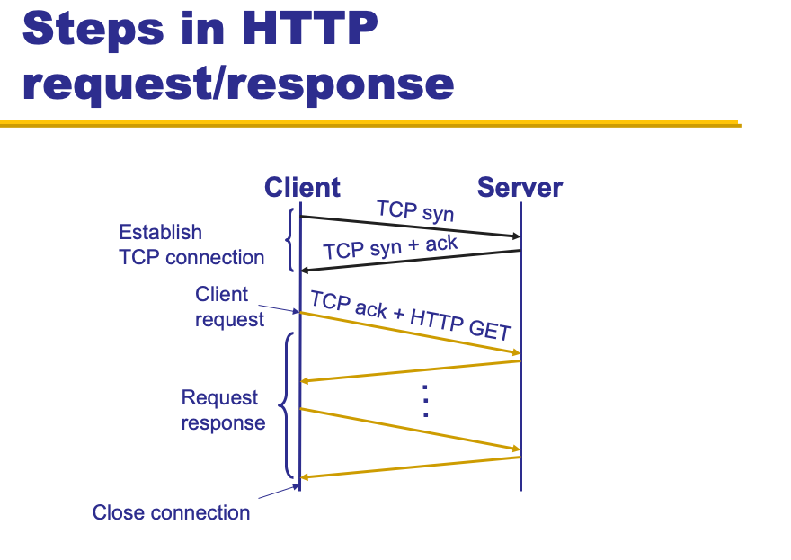
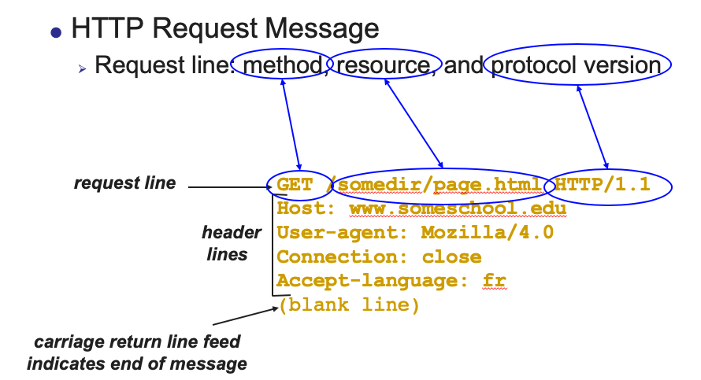
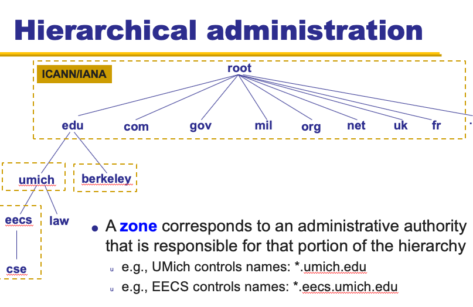

[Goback to Readme](./readme.md)

- [Computer Networks](#computer-networks)
  - [Terminology](#terminology)
    - [Bandwidth](#bandwidth)
    - [Delay](#delay)
    - [Throughput](#throughput)
  - [7 Layer OSI Model](#7-layer-osi-model)
  - [Application Layer](#application-layer)
    - [HTTP](#http)
    - [DNS](#dns)
  - [Transport Layer](#transport-layer)
    - [TCP](#tcp)
    - [UDP](#udp)
  - [IP Layer](#ip-layer)
  - [Link Layer](#link-layer)

## Computer Networks

### Terminology

#### Bandwidth
Number of bits received/sent per unit time

#### Delay

- Transmission Delay
  - The time it takes to put all bits of the packet on the link
  - The transmission delay decrease will cause the bandwidth increase
- Propogation Delay
  - The time for 1 bit moving through the link
- Queuing Delay
  - Amount of time that the packet sitting in the buffer of switcher
- Processing Delay

#### Throughput
How to calculate through put:
T = File size / (transmission delay + propagation delay)

### 7 Layer OSI Model

- L7 Application Layer (SMTP HTTP DNS NTP)
- L6 Presentation Layer
- L5 Session Layer 
- L4 Transport Layer (TCP UDP)
- L3 Network Layer (IP)
- L2 Link Layer (Ethernet WiFi(802.11) )
- L1 Physical Layer (Optical Copper)

The packet will encapsulation in each layer.

The Application and Transportation Layer implemented only on the host. L1-L3 Implemented every where.

### Application Layer
#### HTTP

- HTTP Process

- HTTP Message Framing

- HTTP is stateless
  - Using the cookie to store the state of HTTP

#### DNS
Domain Name System: the sytem will translate the domain name to IP address, and it allows us to go to webpages without having to memorize IP addresses

The Domain name is hierachical. 

### Transport Layer

#### TCP
TCP offers a reliable, in-order, byte stream abstraction.
- Sliding Window
- Go Back N
#### UDP

### IP Layer

### Link Layer