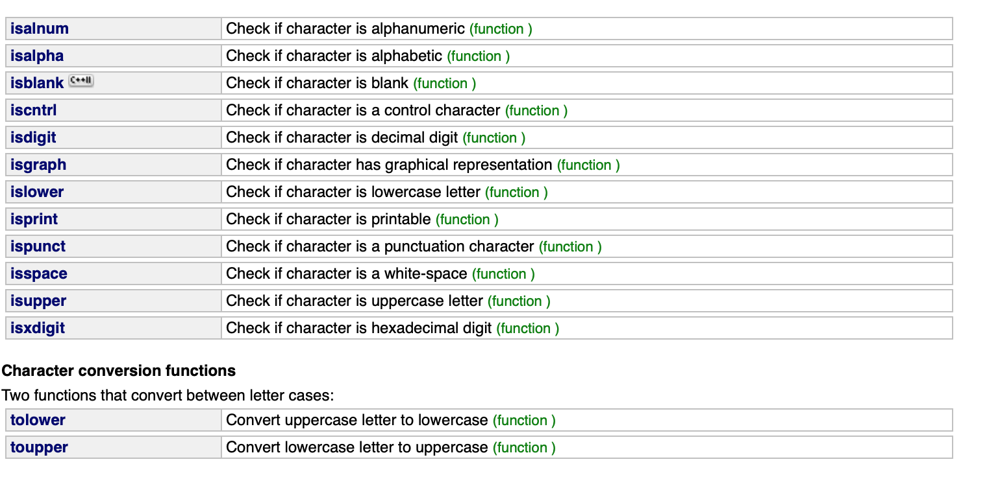
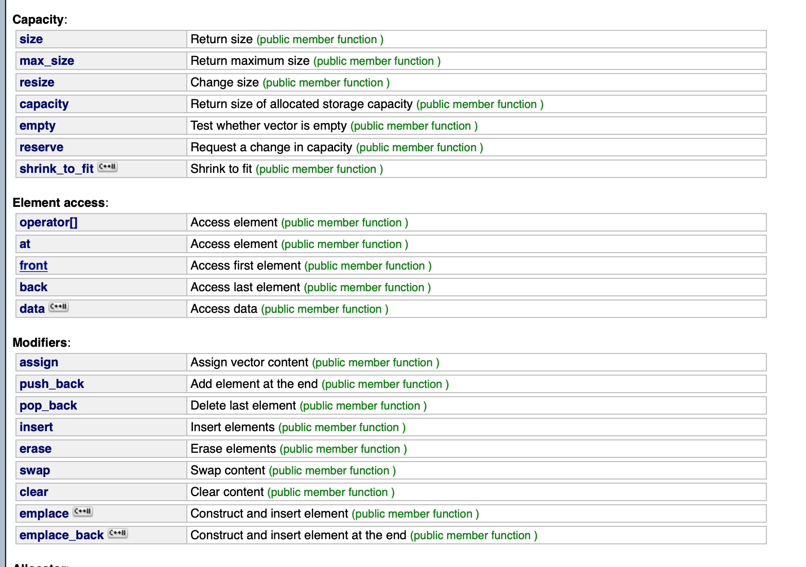
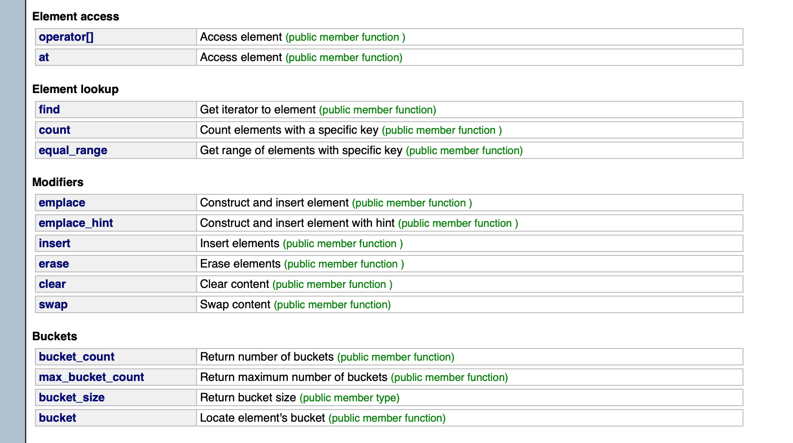

[Goback to Readme](./readme.md)
- [C++](#c)
  - [Frequently use C lib](#frequently-use-c-lib)
  - [Frequently use C++ lib](#frequently-use-c-lib)
  - [Containers](#containers)
    - [Array](#array)
    - [Vector](#vector)
      - [Resize() vs Reserve()](#resize-vs-reserve)
      - [Complexty](#complexty)
    - [Deque (double ended queue)](#deque-double-ended-queue)
      - [Complexity](#complexity)
    - [Forward_list](#forwardlist)
    - [List](#list)
      - [Complexity](#complexity-1)
    - [Map](#map)
      - [Complexity](#complexity-2)
    - [Set](#set)
    - [Queue](#queue)
    - [Priority Queue](#priority-queue)
      - [Complexity](#complexity-3)
    - [Stack](#stack)
    - [Unordered_map](#unorderedmap)
      - [Complexity](#complexity-4)
    - [Unordered_set](#unorderedset)

# C++

## Frequently use C lib
```c++
isalpha(char chr);
isalnum(char chr);
isdigit(char chr);
void * memcpy ( void * destination, const void * source, size_t num );// memcpy can't handle overlap area of copy
void * memmove ( void * destination, const void * source, size_t num );// memmove cand handle the overlapping area of copy
void * memset ( void * ptr, int value, size_t num ); // set the value in memory
```


## Frequently use C++ lib
```c++
// store the increasing sequence
template <class ForwardIterator, class T>
  void iota (ForwardIterator first, ForwardIterator last, T val);


#include <iostream>     // std::cout
#include <numeric>      // std::iota

int main () {
    int numbers[10];
    std::iota (numbers,numbers+10,100);
    std::cout << "numbers:";
    for (int& i:numbers) std::cout << ' ' << i;
    std::cout << '\n';
    return 0;
}
// output:
// numbers: 100 101 102 103 104 105 106 107 108 109

```

## Containers


### Array


### Vector

- Pros
  - vectors use contiguous storage locations for their elements, which means that their elements can also be accessed using offsets on regular pointers to its elements, and just **as efficiently as in arrays**. 
  - But unlike arrays, their size can change **dynamically**, with their storage being handled **automatically** by the container.

- Cons
  - not efficient for insert element and erase element due to the moving elements forward or backward

```c++
// Frequency used method

// Insertion
//single element (1)	
iterator insert (iterator position, const value_type& val);
//fill (2)	
void insert (iterator position, size_type n, const value_type& val);
//range (3)	
void insert (iterator position, InputIterator first, InputIterator last);

// Erase
iterator erase (iterator position);
iterator erase (iterator first, iterator last);
```



#### Resize() vs Reserve()

**Resize**: means change the size of vector and it contains more elements.

**Reserve**: means to reserve more allocated memory for vector, change the capacity.

**Capacity**: return size of allocated storage capacity. This capacity is not necessarily equal to the vector size. It can be equal or greater, with the extra space allowing to accommodate for growth without the need to reallocate on each insertion.


#### Complexty

- insert()
  - O(n) 
  - Linear on the number of elements inserted (copy/move construction) plus the number of elements after position (moving). 
  - If the reallocate happends, it will cost more time on insert.

- erase()
  - O(n)
  - Linear on the number of elements erased (destructions) plus the number of elements after the last element deleted (moving).

### Deque (double ended queue)
Both vectors and deques provide a very similar interface and can be used for similar purposes, but **internally both work in quite different ways**: while vectors use a single array that needs to be occasionally reallocated for growth, the elements of a deque can be **scattered in different chunks of storage**, with the container keeping the necessary information internally to **provide direct access to any of its elements in constant time** and with a uniform sequential interface (through iterators)

- Pros
  - constant time for insert or erase element at the front or back

- Cons
  - linear time for insert or erase element in the middle


#### Complexity

Double-ended queues are designed to be efficient performing insertions (and removals) from **either the end or the beginning** of the sequence.

- insert()
  - O(n)

- erase()
  - O(n)
  
- push_front() pop_front()
  - O(1)

- push_back() pop_back()
  - O(1)


### Forward_list


### List

- Pros
  - Lists are sequence containers that allow **constant time** insert and erase operations anywhere within the sequence, and iteration in both directions.
  - List containers are implemented as doubly-linked lists.


- Cons
  - they lack direct access to the elements by their position

Frequently Use Method
```c++
iterator emplace (const_iterator position, Args&&... args);

```


#### Complexity
- insert()
  - O(1)

- erase()
  - O(1)
  
- push_front() pop_front()
  - O(1)

- push_back() pop_back()
  - O(1)

### Map
Internally, the elements in a map are always **sorted** by its key following a specific strict weak ordering criterion indicated by its internal comparison object (of type Compare).

Maps are typically implemented as **binary search trees**.

- Pros
  - they allow the direct iteration on subsets based on their order.

- Cons
  - map containers are generally slower than unordered_map containers to access individual elements by their key


#### Complexity

- find()
  - O(logN)
  - Logarithmic in size.
- operator[]
  - O(logN) 
  - Logarithmic in size.

### Set

### Queue
Provide **FIFO order** access. Queue is implemented by other container.

The standard container classes deque and list fulfill these requirements. By default, if no container class is specified for a particular queue class instantiation, the **standard container deque** is used.

### Priority Queue

Priority queues are a type of container adaptors, specifically designed such that its **first element is always the greatest** of the elements it contains, according to some strict weak ordering criterion.

The priority queue can be regarded as a heap. The standard container classes **vector and deque** fulfill these requirements. By default, if no container class is specified for a particular **priority_queue class instantiation, the standard container vector** is used.

Several ways to define a priority queue with specific order
```c++
// using the internal comparator
priority_queue<int, vector<int>, greater<int>> pq;
priority_queue<int, vector<int>, less<int>> pq;
```

```c++
// define a class or struct as comparator
// override the operator ()
class Boxer{
    public:
        string name;
        int strength;
};
struct Comp{
    bool operator()(const Boxer& a, const Boxer& b){
        return a.strength<b.strength;
    }
};

int main(){
    priority_queue< Boxer, vector<Boxer>, Comp> pq;
}
```

```c++
// override the operator <
struct People
{
    int age,salary;
    bool operator< (const People & p)const
    {
        if(salary==p.salary)
        {
            return age>p.age;
        }
    else
    {
        return salary>p.salary;
    }
}};
int main(){
    priority_queue<People> pq;
}
```
```c++
// using the lambda function
// in the capture you can pass some global variable which detemine the order
auto comp = [&matrix]( adjist a, adjlist b ) { return a.second > b.second;};
priority_queue<adjlist_edge,vector<adjlist_edge>, decltype( comp ) > adjlist_pq( comp );
```
#### Complexity

- push()
  - O(logN)
- pop()
  - O(logN)


### Stack
The Stack proives LIFO order access. Stack is implemented by other container.

The standard container classes **vector, deque and list** fulfill these requirements. By default, if no container class is specified for a particular stack class instantiation, the **standard container deque**is used.


### Unordered_map
Implemented with hash table and using the chaining to avoid hash collision

- Pros
  - containers are faster than map containers to **access individual elements by their key, O(1)**
  - 

- Cons
  - Internally, the elements in the unordered_map are not sorted in any particular order 

Notices:
A **bucket** is a slot in the container's internal hash table. It is assigned to element based on their hash value of key



#### Complexity

- find()
  - O(1)
- erase()
  - O(1)
- operator[]
  - O(1)


### Unordered_set


