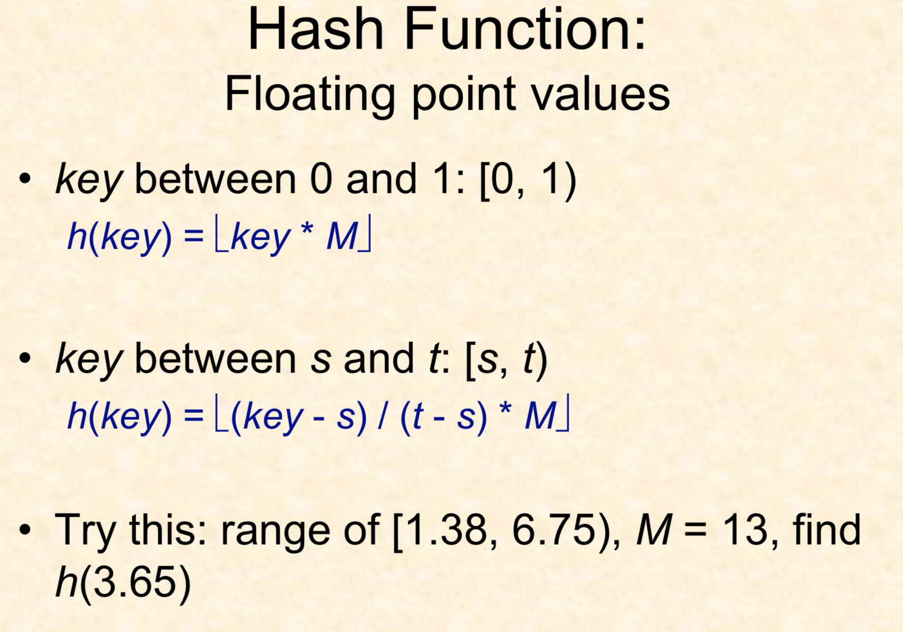
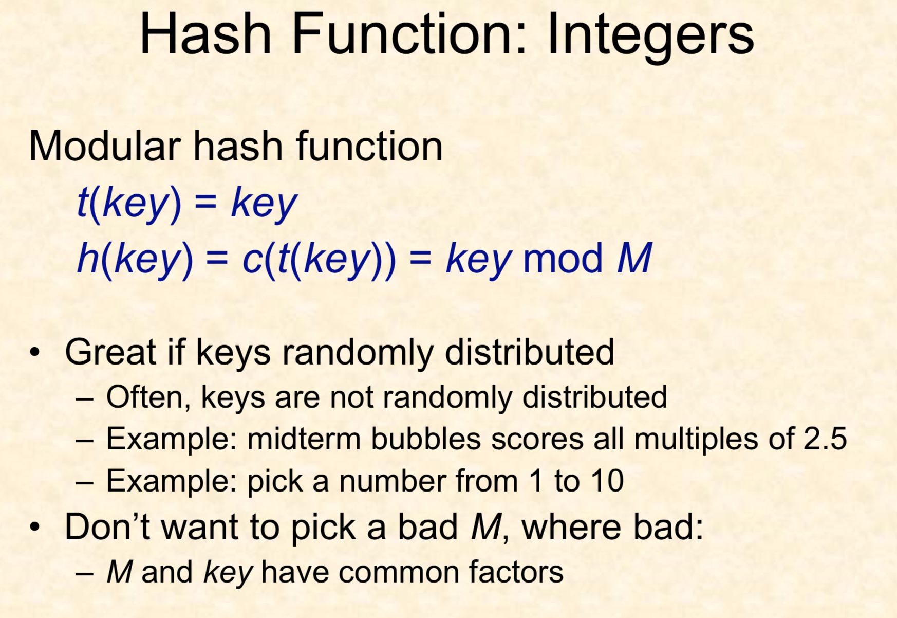
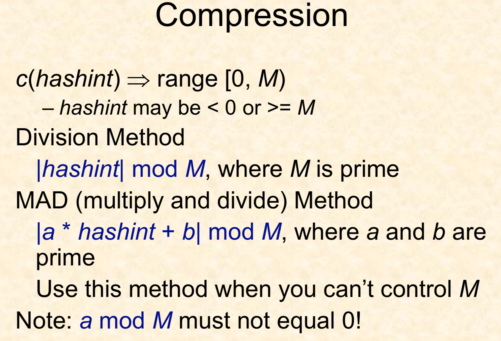

[Goback to Readme](./readme.md)

## Data Structure and Algorithm

### Hash table

- Table of size M
- About the number of elements expected – If unsure, guess high
- Hash function must transform keys into integers in range [0, M)




If the hash int is less than 0 or greater than M, we can use the compresson function to limit it in the [0,M)



If you only has small amount of integers as the key, it is better to use the the arrays as hash_map

### Bit manipulation

Get the first bit with 1
```c++

```