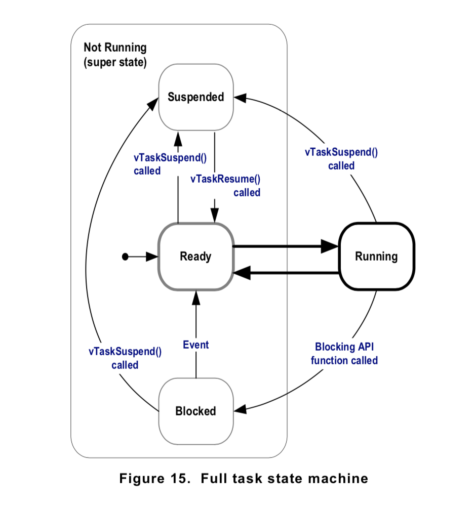
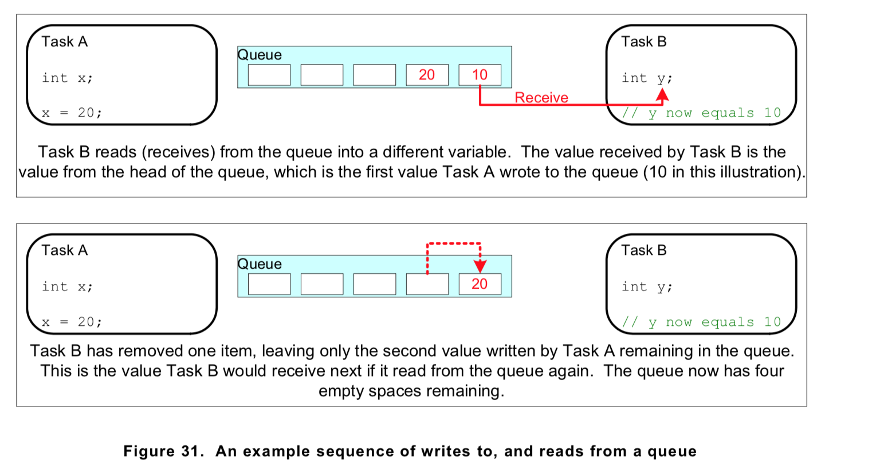
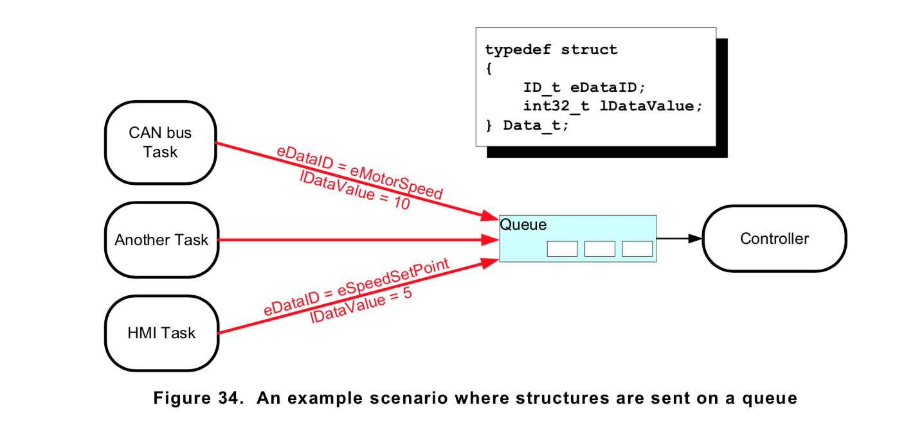
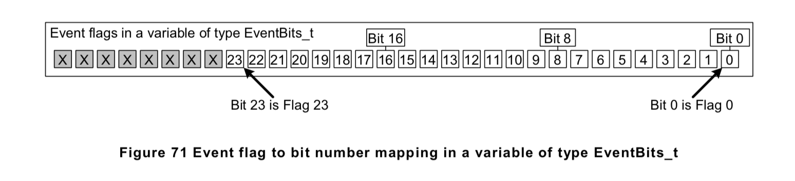

# General Topics

## Bluetooth Low Energy

### Overview

Bluetooth 4.2 allows two systems of wireless technology, Bluetooth Basic Rate (BR: BR/EDR for Basic Rate/Enhanced Data Rate) and Bluetooth Low Energy.

The base rate was usually applied in applications like wirelss headphones. The low engery system was created to trasmit small package of data.


The Bluetooth Low Energy protocol stack consists of host and controller.
- the controller, it consists of three parts: Host-cotroller interfaces, Link layer, and Physical layer.
- the Host, it consists fo GAP, GATT, SM, ATT, L2CAP.
- Any application or profile always sit on hte GAP and GATT layer. Usuallly we only need to take care of GAT and GATT layer.

The GAP layer control the RF state of the device, there are five RF states for a device:
- Standby
- Advertising: advertiser transmited data without connecting
- Scanning: scanner scan for the advertiser
- Initiating: innitiator is a device which respond to a advertiser 
- Connected: when connected, the device become either a master for slave. the connection initialtor is the master, the one accept the request is the slave.

The Logical Link Control and Adaptation Layer Protocol (L2CAP) layer provides data encapsulation services to the upper layers, allowing for logical end-to-end communication of data.


### GAT


#### State diagram of a device


- Standby: The device is in the initial idle state upon reset.
- Advertiser: The device is advertising with specific data letting any initiating devices know that it is a connectible device (this advertisement contains the device address and can contain some additional data such as the device name).
- Scanner: When receiving the advertisement, the scanning device sends a scan request to the advertiser. The advertiser responds with a scan response. This process is called device discovery. The scanning device is aware of the advertising device and can initiate a connection with it.
- Initiator: When initiating, the initiator must specify a peer device address to which to connect. If an advertisement is received matching that address of the peer device, the initiating device then sends out a request to establish a connection (link) with the advertising device with the connection parameters described in Connection Parameters.

#### Connection Parameter


- Connection interval is the amount of time between two connection events
-  If there is no application data to be sent or received, the two devices exchange link layer data to maintain the connection
- Slave Latency - This parameter gives the slave (peripheral) device the option of skipping a number of connection events. 
- Effective connection intervals is the interval between two successful connection event when the slave latency is specified.

### GATT

the GATT layer of the Bluetooth low energy protocol stack is used by the application for data communication between two connected devices

- The GATT server: the device containing the characteristic database that is being read or written by a GATT client.
- The GATT client: the device that is reading or writing data from or to the GATT server.

#### GATT Characteristics and Attributes

- Characteristics as groups of information called attributes
- Attributes are the information actually transferred between devices
- 
#### GATT Security


## Bluetooth Mesh


## Embedded C

### Unsigned vs Signed

Convert the unsigned int to signed int, minus 2^32 if the unsigned int greater than 2^31;
Covert the signed int to unsigned int, plus 2^32 if the signed int less than 0;

```c++
// Function to determine overflow for add two unsigned number
bool uadd_ok(uint32_t x, uint32_t y){
    if(x + y < x)
        // here means overflow
        return false;
    return true;
}

// Functoin to determin overflow for add two signed number
bool sadd_ok(int x, int y){
    if(x > 0 && y > 0){
        if(x + y  <=0)
        // overflow when add two positive integer
            return true;
    }
    if(x < 0 && y< 0){
        if(x + y >=0)
        // overflow when add two negative integer
            return true;
    }
    return false;
}

```
### Floating
The representation of floating point in register are shown above.


### Struct

#### Data alignment

Many computer system has restrictions on data alignment, they only allow the program to access address which is multiple of some value K (typically 2, 4, or 8), and this restriction is called memory alignment.


### Function pointer


```c++
int (*fp) (int); // here remember to define (*fp), otherwise, it means that the function with pointer return type
```

### Dynamic allocate memory
```c++
ptr = (int*) malloc(100 * sizeof(int));	//allocates the specified number of bytes

ptr = realloc(ptr, new_size);	//increases or decreases the size of the specified block of memory, moving it if necessary

ptr = (float*) calloc(25, sizeof(float));	//allocates the specified number of bytes and initializes them to zero
free(*ptr)	//releases the specified block of memory back to the system
```
### Static qulifier
- Static for global variable: access it limited in this file
- Static function: limited acces in file
- Static local variable in function: the value will be maintained between function calls
- 

### Diference between Macro and Inline

## Micro-controller

### GPIO

#### External Pull-up and Pull-down
To ensure a logic level at a pin, avoiding it floating in the air. When a pin is not pulled to a low or high logic level, then the high impedance state occurs.


#### GPIO input mode
High-impedance (default - floats if not driven)

Pull-up (internal resistor connected to VCC) 

Pull-down (internal resistor connected to Ground)  

### Memory Mapped IO
Memory-mapped I/O uses the same **address space** to address both memory and I/O devices. The memory and registers of the I/O devices are mapped to (associated with) address values. *So when an address is accessed by the CPU, it may refer to a portion of physical RAM, or it can instead refer to memory of the I/O device*. Thus, the CPU instructions used to access the memory can also be used for accessing devices. 
Linux -> ioremap() 

Port-mapped I/O :I/O devices have a separate address space from general memory, either accomplished by an extra "I/O" pin on the CPU's physical interface, or an entire bus dedicated to I/O.  Uses a special class of CPU instructions to access I/O devices 


### ARM ISA
- General purpose register R0 - R12 
- Special purpose: 
  - Stack pointer: points to the top of the stack 
  - Link register: store the return addr when a subroutine call is made 
  - Program counter: incremented by the size of the instruction executed (which is always four bytes in ARM state). Branch instructions load the destination address into PC. During execution, PC stores the address of the current instruction plus 8 (two ARM instructions) in ARM state, and the current instruction plus 4 (two Thumb instructions) in Thumb(v1) state. 
  - Application program status register: holds the program status flags that are accessible in any processor mode.  

### DMA (Direct Memory Access)
Direct memory access (DMA) is an interfacing technique that allows data to transfer directly from I/O device to memory, or from memory to the I/O device without going through the processor. Embedded system designers will need to use DMA when interfacing high speed devices.

### Peripheral Communication

#### SPI

You might be thinking to yourself, self, that sounds great for one-way communications, but how do you send data back in the opposite direction? Here's where things get slightly more complicated.

In SPI, only one side generates the clock signal (usually called CLK or SCK for Serial ClocK). The side that generates the clock is called the "master", and the other side is called the "slave". There is always only one master (which is almost always your microcontroller), but there can be multiple slaves (more on this in a bit).

When data is sent from the master to a slave, it's sent on a data line called MOSI, for "Master Out / Slave In". If the slave needs to send a response back to the master, the master will continue to generate a prearranged number of clock cycles, and the slave will put the data onto a third data line called MISO, for "Master In / Slave Out".


Notice we said "prearranged" in the above description. Because the master always generates the clock signal, it must know in advance when a slave needs to return data and how much data will be returned. This is very different than asynchronous serial, where random amounts of data can be sent in either direction at any time. In practice this isn't a problem, as SPI is generally used to talk to sensors that have a very specific command structure. For example, if you send the command for "read data" to a device, you know that the device will always send you, for example, two bytes in return. (In cases where you might want to return a variable amount of data, you could always return one or two bytes specifying the length of the data and then have the master retrieve the full amount.)

Note that SPI is "full duplex" (has separate send and receive lines), and, thus, in certain situations, you can transmit and receive data at the same time (for example, requesting a new sensor reading while retrieving the data from the previous one). Your device's datasheet will tell you if this is possible.

#### I2C

1. Basics
Messages are broken up into two types of frame: an **address frame**, where the master indicates the slave to which the message is being sent, and one or more **data frames**, which are 8-bit data messages passed from master to slave or vice versa. Data is placed on the SDA line after SCL goes low, and is sampled after the SCL line goes high. The time between clock edge and data read/write is defined by the devices on the bus and will vary from chip to chip.

2. Start Condiction
To initiate the address frame, the master device **leaves SCL high and pulls SDA low.** This puts all slave devices on notice that a transmission is about to start. If two master devices wish to take ownership of the bus at one time, whichever device pulls SDA low first wins the race and gains control of the bus. It is possible to issue repeated starts, initiating a new communication sequence without relinquishing control of the bus to other masters; we'll talk about that later.


3. Address Frame
The address frame is always first in any new communication sequence. For a 7-bit address, the address is clocked out most significant bit (MSB) first, followed by a R/W bit indicating whether this is a read (1) or write (0) operation.
The 9th bit of the frame is the NACK/ACK bit. This is the case for all frames (data or address). Once the first 8 bits of the frame are sent, the receiving device is given control over SDA. If the receiving device does not pull the SDA line low before the 9th clock pulse, it can be inferred that the receiving device either did not receive the data or did not know how to parse the message. In that case, the exchange halts, and it's up to the master of the system to decide how to proceed.

4. Data Frame
After the address frame has been sent, data can begin being transmitted. The master will simply continue generating clock pulses at a regular interval, and the data will be placed on SDA by either the master or the slave, depending on whether the R/W bit indicated a read or write operation. The number of data frames is arbitrary, and most slave devices will auto-increment the internal register, meaning that subsequent reads or writes will come from the next register in line.


5. Stop Condition
Once all the data frames have been sent, the master will generate a stop condition. Stop conditions are defined by a 0->1 (low to high) transition on SDA after a 0->1 transition on SCL, with SCL remaining high. During normal data writing operation, the value on SDA should not change when SCL is high, to avoid false stop conditions.

6. Repeated Start Condition
it is important that a master device be allowed to exchange several messages in one go, without allowing other master devices on the bus to interfere. For this reason, the repeated start condition has been defined.


7. Clock Stretching
the master's data rate will exceed the slave's ability to provide that data. This can be because the data isn't ready yet (for instance, the slave hasn't completed an analog-to-digital conversion yet) or because a previous operation hasn't yet completed (say, an EEPROM which hasn't completed writing to non-volatile memory yet and needs to finish that before it can service other requests).


#### Serial Communication

1. UART
A universal asynchronous receiver/transmitter (UART) is a block of circuitry responsible for implementing serial communication. Essentially, the UART acts as an intermediary between parallel and serial interfaces. On one end of the UART is a bus of eight-or-so data lines (plus some control pins), on the other is the two serial wires - RX and TX.

UART transmitted data is organized into packets. Each packet contains 1 start bit, 5 to 9 data bits (depending on the UART), an optional parity bit, and 1 or 2 stop bits:

In most cases, the data is sent with the **least significant bit first**.

- **start bit**
  - The UART data transmission line is normally held at a high voltage level when it’s not transmitting data. 
  - To start the transfer of data, the transmitting UART pulls the transmission line from high to low for one clock cycle. 
  - When the receiving UART detects the high to low voltage transition, it begins reading the bits in the data frame at the frequency of the baud rate. 
- **data bits**
  - actual data
- parity bit
  - Parity describes **the evenness or oddness of a number**. The parity bit is a way for the receiving UART to tell if any data has changed during transmission.
  - If the parity bit is a 0 (even parity), the 1 bits in the data frame should total to an even number. 
  - If the parity bit is a 1 (odd parity), the 1 bits in the data frame should total to an odd number.
- stop bit
  - To signal the end of the data packet, the sending UART drives the data transmission line from a low voltage to a high voltage for at least two bit durations.


1. Software UARTs
If a microcontroller doesn't have a UART (or doesn't have enough), the serial interface can be bit-banged - directly controlled by the processor. This is the approach Arduino libraries like SoftwareSerial take. **Bit-banging** is **processor-intensive**, and not usually as precise as a UART, but it works in a pinch!


## Linux


### Booting


### Kernel


## Computer Architecture


### 


## Operating System

### Deadlock
- Mutual Exclusion: One or more than one resource are non-sharable (Only one process can use at a time)
- Hold and Wait: A process is holding at least one resource and waiting for resources.
- No Preemption: A resource cannot be taken from a process unless the process releases the resource.
- Circular Wait: A set of processes are waiting for each other in circular form.

### Thread Control Block
- Thread Identifier: Unique id (tid) is assigned to every new thread
- Stack pointer: Points to thread's stack in the process
- Program counter: Points to the current program instruction of the thread
- State of the thread (running, ready, waiting, start, done)
- Thread's register values
- Pointer to the Process control block (PCB) of the process that the thread lives on

The blow shoe the different states of thread

### Process vs Thread
- Threads are not independent of one other like processes as a result threads shares with other threads their code section, data section and OS resources like open files and signals. But, like process, a thread has its own program counter (PC), a register set, and a stack space.
- Processes start out with a single main thread. The main thread can create new threads using a thread fork system call. The new threads can also use this system call to create more threads. Consequently, a thread not only belongs to a process; it also has a parent thread - the thread that created it.

### Thread Synchronization
Locks:
- spin lock
  - With a spinlock, the thread simply waits ("spins") until the lock becomes available. This is efficient if threads are blocked for a short time, because it avoids the overhead of operating system process re-scheduling. 
  - It is inefficient if the lock is held for a long time, or if the progress of the thread that is holding the lock depends on preemption of the locked thread.
- mutex
  - provide mutual exclusion for the resources, and it will block the thread if the resrouce is no availble. CPU would reschedule the thread when the lock is available.

Semaphores:
- counting semaphore
  - Every time you wait on a semaphore, you decrease the current count. 
  - If the count was greater than zero then the decrement just happens, and the wait call returns. 
  - If the count was already zero then it cannot be decremented, so the wait call will block until another thread increases the count by signalling the semaphore.
  - Every time you release a semaphore, you increase the current count.
  - If the count was zero before you called signal, and there was a thread blocked in wait then that thread will be woken. If multiple threads were waiting, only one will be woken
  - If the count was already at its maximum value then the signal is typically ignored, although some semaphores may report an error.


- binary semaphore
  - it is pretty much similar to the mutex

### Producer and Consumer
This is the template for the producer and consumer models in Operating System, it uses the semaphore and mutext to protect resources like ring buffer


### Paging 
Paging is a memory management scheme that eliminates the need for contiguous allocation of physical memory. This scheme permits the physical address space of a process to be non – contiguous.

Pages has two states: **valid** and **resident**.

**Valid** means the page are allocated to the program, and it is legal for the process to access.

**Redident** means the page are already in the physical memory.

Page size usually 4KB or 8KB


#### Virtual Memory


### Inter Process Communication
Inter process communication (IPC) is a mechanism which allows processes to communicate each other and synchronize their actions. 
The communication between these processes can be seen as a method of co-operation between them. Processes can communicate with each other using these two ways:
1. Shared Memory
2. Message passing


## Computer Networks


## Compiler Construction

### Lexical Analysis
It turns a stream of characters into a stream of tokends. Tokens is to define a class of word. Like in engish, we have noun, objective, verb. For programming language we have integer, string, variable and so on.

Typical, in this step, we use regular expression to match these tokens.

### Parsing
Parsing will generate the abstract syntax tree fron the tokens. Parsing using the context free language to describe the grammer.

You can think about the if expression, the root of the syntrax tree will be if_exp, the child will be the condition, codes in the if statement. else 


### Type checking
When we got the syntax tree, then we do type checking of the code. The inference rule will define the type of different expressions. Like for the if statement, the type of its conndition must be bool. For the function call the type checker will check if the type of paramter and the arguments of that function call meet the definition.

### THe last step: code generation


### Program organization

When the program is invoked, the operating system will allocate spaces for this program. The machien code will be loded into the space.

### Optmization
In order to do optimization, we need convert the code into a intermediate representation which is convenient for us to analysis the patterns in the code.
For the dead code elimination, we only do it for assignment instruction. Through the liveness analysis, where the dead code is, and remove it from my syntax tree.


## Advanced Embedded System

### Building Interfaces
Hardware interfaces allow the programmer to not worry about how exactly the hardware works. It creats a level of abstraction. It allows the application to be written independent of platform or target. 

A good hardware interface has three key features:
- easy to use
- efficent 
- portable to other hardware platform

Three competing requirements (triangle):
- usability
- efficiency
- portability

Software or Hardware first?
In terms of interface design, we can start the software design firstly. Give the pre-designed API about how the interface will look like.

### Real-time system
The official definition of a real-time operating system is that: the correctness of system not only rely on the result but also the time of the result was produced.

Why RT system is Hard
- people want a cheap processor as possible
- there are non-cpu resources to worry about
- Validation is hard: it is a simple question of how do people know the system miss the deadline

Validation is catually the process to prove that your solution meet the constriants.

Property of scheduling task:
- Fix/dynamic priority: the prioriity of tasks can be assigned dynamicly or staicly. D: EDF, S: RM
- Preemptive/Non-preemptive tasks: non-preemptive tasks it task that can not be interuptre once it start

Critical instant analysis:
- The worst case for RMS is that all tasks happen to start at the exact same time.


### Kernel

Kernel is a core part of operating system for managing system resources. It more like a bridge between appliation and hardware.
Kernel process and user process has different adress spaces.


### Power Integration


# Resume Details


## CC2640 Bluetoot SoC


## TI-RTOS

The TI-RTOS is a RTOS kernel, specially designed for TI's Bluetooth SoC, like CC2640. It is a real-time, pre-emptive, and multi-threaded operating system.

### Threading module
It has four thread modules. Hardware interrupts, software interrupts, task and idle task.
The TI RTOS manages four distince context levels of thread execution


#### HWI
- threads are threads with highest priority in TI-RTOS
- used to perform the time critical task which are subject to the hard deadline.
- no blocking API may be called HW ISR


#### SWI
- provide addtional level of priority between HWI and normal tasks. 
- SWI is triggered programmatically by calling certain SWI modules API
- Swi allows the HWI to defer the less time critical and more time consuming works to a lower-priority task
- Swi require only enough space to store the context of each Swi priority level, while task actually use a sperate stack for each thread


#### Task
- task thread has lower priority than the SWI, and higher priotiryt than the IDLE task
- TI-RTOIS actually provided many mechanisim for thread synchronization like Semaphores, Event, Message queues


#### Idel Task


### Thread Synchronization Model

#### Semaphores

- Semaphores can be counting semaphores or binary semaphores
- Counting semaphore will track the number of times the semaphore was post. When one task want to grad the semaphore it will see it the count is greater than 0, then decrement the count
- Binary semaphore can be regraded as mutex

#### Event
- It was implemented through the semaphore
- The task can be pending on several event happen.
- Event can be posted by calling the Event API in TI-RTOS


#### Message Queue

- Message queue provides thead-safe unidirectional message passing module, like a FIFO. 
- It was commonly used to pass messages from high priority task to low priority task.
- For the key pad, once it was pressed, it will triger the HWI to pass the message to the user application task, it will read the key value from the Key Pad scanning IC. The work associated to the inerrupt can defered to tasks for processing.
- The queue is also used to process the message sent from the Blueooth Protocol Stack. 


#### Tasks 
  

Different states of tasks:

- Running: task is currently running
- Ready: task is scheduled for execution
- Blocked: task is suspended from execution
- Terminated: task is terminated from execution
- Inactive: task is on inactive list

## AliOS-Things


## Free RTOS

### Task States
Fours task states: running, blocked, ready, suspended


The suspended state will enter only through calling the TaskSuspend().


### Task Sychronization

1. Mutex


2. Counting Semaphore
```c++
// Initialize
SemaphoreHandle_t xSemaphoreCreateCounting( UBaseType_t uxMaxCount, UBaseType_t uxInitialCount );

//
xCountingSemaphore = xSemaphoreCreateCounting( 10, 0 );

static uint32_t ulExampleInterruptHandler( void )
{
BaseType_t xHigherPriorityTaskWoken;
    /* The xHigherPriorityTaskWoken parameter must be initialized to pdFALSE as it
    will get set to pdTRUE inside the interrupt safe API function if a context switch
    is required. */
    xHigherPriorityTaskWoken = pdFALSE;
    /* 'Give' the semaphore multiple times.  The first will unblock the deferred
    interrupt handling task, the following 'gives' are to demonstrate that the
    semaphore latches the events to allow the task to which interrupts are deferred
    to process them in turn, without events getting lost.  This simulates multiple
    interrupts being received by the processor, even though in this case the events
    are simulated within a single interrupt occurrence. */
    xSemaphoreGiveFromISR( xCountingSemaphore, &xHigherPriorityTaskWoken );
    xSemaphoreGiveFromISR( xCountingSemaphore, &xHigherPriorityTaskWoken );
    xSemaphoreGiveFromISR( xCountingSemaphore, &xHigherPriorityTaskWoken );
    /* Pass the xHigherPriorityTaskWoken value into portYIELD_FROM_ISR().  If
    xHigherPriorityTaskWoken was set to pdTRUE inside xSemaphoreGiveFromISR() then
    calling portYIELD_FROM_ISR() will request a context switch.  If
    xHigherPriorityTaskWoken is still pdFALSE then calling portYIELD_FROM_ISR() will
    have no effect. Unlike most FreeRTOS ports, the Windows port requires the ISR to
    return a value - the return statement is inside the Windows version of
    portYIELD_FROM_ISR(). */
    portYIELD_FROM_ISR( xHigherPriorityTaskWoken );
}

// Task to get the semaphore
static void vHandlerTask( void *pvParameters )
{
    /* As per most tasks, this task is implemented within an infinite loop. */
    for( ;; ) {
        /* Use the semaphore to wait for the event.  The semaphore was created
        before the scheduler was started, so before this task ran for the first
        time.  The task blocks indefinitely, meaning this function call will only
        return once the semaphore has been successfully obtained - so there is
        no need to check the value returned by xSemaphoreTake(). */
        xSemaphoreTake( xBinarySemaphore, portMAX_DELAY);
        /* To get here the event must have occurred.  Process the event (in this
        Case, just print out a message). */
        vPrintString( "Handler task - Processing event.\r\n" );
    } 
}
```

### Queue
Queues provide a task-to-task, task-to-interrupt, and interrupt-to-task communication mechanism. Queues are normally used as First In First Out (FIFO) buffers, where data is written to the end (tail) of the queue and removed from the front (head) of the queue. 



#### Typical Design

It is common in FreeRTOS designs for a task to receive data from more than one source. The receiving task needs to know where the data came from to determine how the data should be processed. An easy design solution is to use a single queue to transfer structures with both the value of the data and the source of the data contained in the structure’s fields. This scheme is demonstrated in Figure 34




### Event Groups
Features:
- Event groups allow a task to wait in the Blocked state for a combination of one of more events to occur.
- Event groups unblock all the tasks that were waiting for the same event, or combination of events, when the event occurs.
- These unique properties of event groups make them useful for synchronizing multiple tasks
- Event groups also provide the opportunity to reduce the RAM used by an application, as often it is possible to replace many binary semaphores with a single event group.

Each event will be represents by one bit in the Event group, if it has occured, the bit will be 1, otherwise it will be zero. The specific meaning of each bit in the event groups is specified by the user.


```c++
static void vEventBitReadingTask( void *pvParameters )
{
EventBits_t xEventGroupValue;
const EventBits_t xBitsToWaitFor = ( mainFIRST_TASK_BIT  | mainSECOND_TASK_BIT |
mainISR_BIT );
for( ;; ) {
/* Block to wait for event bits to become set within the event group. */
xEventGroupValue = xEventGroupWaitBits( /* The event group to read. */
                                        xEventGroup,
                                        /* Bits to test. */
                                        xBitsToWaitFor,
                                        /* Clear bits on exit if the
                                        unblock condition is met. */
                                        pdTRUE,
                                        /* Don't wait for all bits.  This
                                        parameter is set to pdTRUE for the
                                        second execution. */
                                        pdFALSE,
                                        /* Don't time out. */
                                        portMAX_DELAY );
/* Print a message for each bit that was set. */
if( ( xEventGroupValue & mainFIRST_TASK_BIT ) != 0 )
{
    vPrintString( "Bit reading task -\t Event bit 0 was set\r\n" );
}
if( ( xEventGroupValue & mainSECOND_TASK_BIT ) != 0 )
{
    vPrintString( "Bit reading task -\t Event bit 1 was set\r\n" );
}
if( ( xEventGroupValue & mainISR_BIT ) != 0 )
{
    vPrintString( "Bit reading task -\t Event bit 2 was set\r\n" );
}
} }


static void vEventBitSettingTask( void *pvParameters )
{
    const TickType_t xDelay200ms = pdMS_TO_TICKS(200UL), xDontBlock = 0;
for( ;; ) {

    /* Delay for a short while before starting the next loop. */
    vTaskDelay( xDelay200ms );
    /* Print out a message to say event bit 0 is about to be set by the task,
    then set event bit 0. */
    vPrintString( "Bit setting task -\t about to set bit 0.\r\n" );
    xEventGroupSetBits( xEventGroup, mainFIRST_TASK_BIT );
    /* Delay for a short while before setting the other bit. */
    vTaskDelay( xDelay200ms );
    /* Print out a message to say event bit 1 is about to be set by the task,
    then set event bit 1. */
    vPrintString( "Bit setting task -\t about to set bit 1.\r\n" );
    xEventGroupSetBits( xEventGroup, mainSECOND_TASK_BIT );
 
} 
}

```

Even synchronization allows multiple tasks synchronize one a specific time. For example, the TCP/IP tx task and TCP/IP rx task are sending and receiving data at the sametime. The tx task will close the socket only when the rx task finish the transmission. They need meet at specific point which both of them finish their tasks.

```c++
void SocketTxTask( void *pvParameters ) {
xSocket_t xSocket;
uint32_t ulTxCount = 0UL;
for( ;; ) {
/* Create a new socket. This task will send to this socket, and another task will receive from this socket. */
xSocket = FreeRTOS_socket( ... );
      /* Connect the socket. */
FreeRTOS_connect( xSocket, ... );
/* Use a queue to send the socket to the task that receives data. */
xQueueSend( xSocketPassingQueue, &xSocket, portMAX_DELAY);
/* Send 1000 messages to the socket before closing the socket. */
    for( ulTxCount = 0; ulTxCount < 1000; ulTxCount++ ) {
        if( FreeRTOS_send( xSocket, ... ) < 0 )
        {
            /* Unexpected error */
            break; 
        }
    }
    /* exit the loop, after which the socket will be closed.
    Tx task wants to close the socket. */
    /* Let the Rx task know the socket will close */
    TxTaskWantsToCloseSocket();
    /* This is the Tx task’s synchronization point. The Tx task waits here for the Rx task to reach its synchronization point. The Rx task will only reach its synchronization point when it is no longer using the socket, and the socket can be closed safely. */
    xEventGroupSync( ... );
    /* Neither task is using the socket. Shut down the connection, then close the socket. */
    FreeRTOS_shutdown( xSocket, ... ); WaitForSocketToDisconnect(); 
    FreeRTOS_closesocket( xSocket );
} }
/*-----------------------------------------------------------*/
void SocketRxTask( void *pvParameters ) {
xSocket_t xSocket;
for( ;; ) {
    /* Wait to receive a socket that was created and connected by the Tx task. */
    xQueueReceive( xSocketPassingQueue, &xSocket, portMAX_DELAY );
    /* Keep receiving from the socket until the Tx task wants to close the socket. */
    while( TxTaskWantsToCloseSocket() == pdFALSE ) {
          /* Receive then process data. */
          FreeRTOS_recv( xSocket, ... );
          ProcessReceivedData();
      }
    /* This is the Rx task’s synchronization point - it only reaches here when it is no longer using the socket, and it is therefore safe for the Tx task to close the socket. */ 
    xEventGroupSync( ... );
} }

```