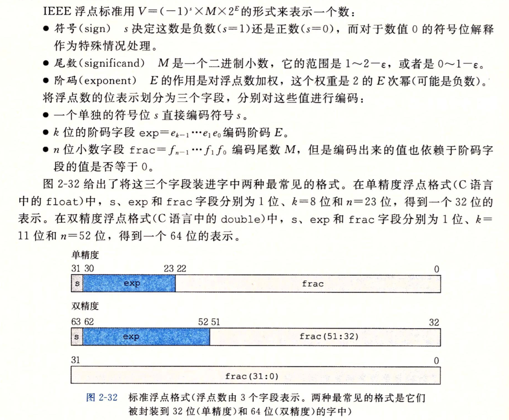
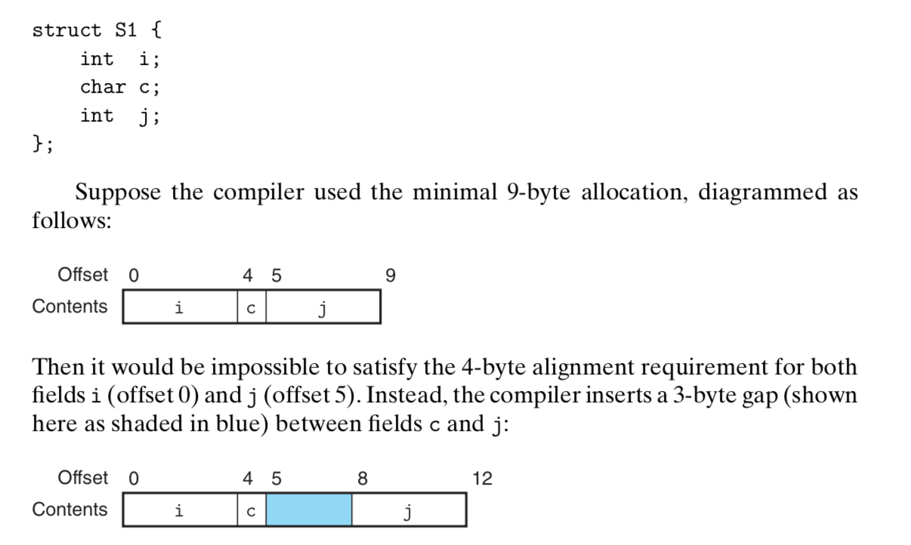
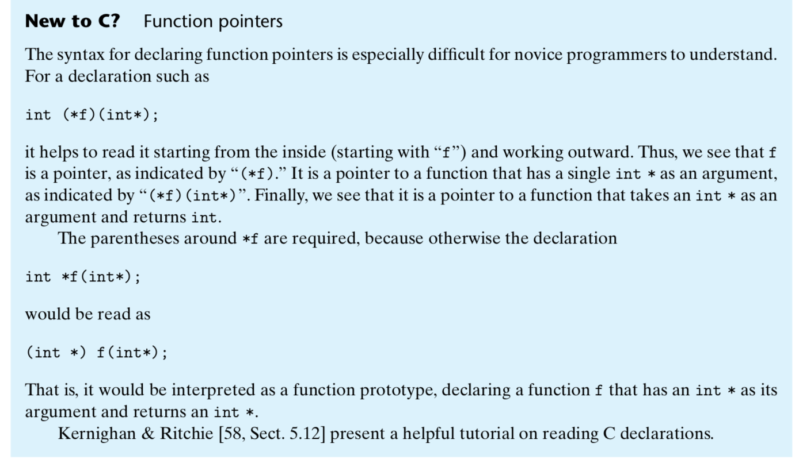

[Goback to Readme](./readme.md)

- [Embedded C](#embedded-c)
  - [Endianess](#endianess)
  - [Bit-field](#bit-field)
  - [Volatile](#volatile)
  - [Macro vs Inline func](#macro-vs-inline-func)
  - [Different Pointer define](#different-pointer-define)
  - [Access fixed memory location](#access-fixed-memory-location)
  - [Typedef vs Macro](#typedef-vs-macro)
  - [Unsigned vs Signed](#unsigned-vs-signed)
  - [Floating](#floating)
  - [Struct](#struct)
    - [Data alignment](#data-alignment)
  - [Function pointer](#function-pointer)
  - [Dynamic allocate memory](#dynamic-allocate-memory)
  - [Static qulifier](#static-qulifier)
  - [Const qulifier](#const-qulifier)
  - [Diference between Macro and Inline](#diference-between-macro-and-inline)
  - [Reentrant Function](#reentrant-function)

## Embedded C


### Endianess
Endianness is the sequential order in which bytes are arranged in memory 
- Big endian: MSB placed at the lowest addr 
- Little endian: LSB placed at the lowest addr 
```c++
int main() 
{ 
    int x = 1; 
    char *y = (char*)&x; 
    printf("%c\n",*y+48); 
} 
```
### Bit-field


### Volatile

A volatile variable is one that can change unexpectedly. Consequently, the compiler can make no assumptions about the value of the variable. In particular, the optimizer must be careful to reload the variable every time it is used instead of holding a copy in a register. Examples of volatile variables are:

- Non-automatic variables referenced within an interrupt service routine. A global or static variable used in an interrupt will appear to change unexpectedly at the task level, so the volatile keyword is needed to inform the compiler that this will happen.

- Variables shared by multiple tasks in a multi-threaded application 
- Hardware registers in peripherals (for example, status registers)

Every time the code encountered the volatile variable, the program will take the value of the given volatile variable from the main memory every time it encounters
```c++

uint8_t volatile * p_ledreg = 0x10000000;

//The valatile should be placed before the *
// In the above code, the variable p_legreg is a pointer to a volatile 8-bit unsigned register located at address 0x10000000.

typedef volatile struct
{
uint8_t reg1;
uint8_t reg2;
uint8_t _reserved;
uint8_t reg3;

} mydevice_t;

mydevice_t * p_mydevice = 0x10000000;

// or
typedef struct
{
uint8_t reg1;
uint8_t reg2;
uint8_t _reserved;
uint8_t reg3;

} mydevice_t;

mydevice_t volatile * p_mydevice = 0x10000000;
```

### Macro vs Inline func

Macro:
- expanded by the preprocessor, directly replace the code section
- just do the replacement according to the define
```c++
// This code can be a problem: when using the min(*p++, val)
#define min(X, Y)  ((X) < (Y) ? (X) : (Y))

```
Inline func
- only parsed by the compiler
- it is actually programs which can access the member variables

### Different Pointer define
- int a; // An integer
- int *a; // A pointer to an integer
- int **a; // A pointer to a pointer to an integer
- int a[10]; // An array of 10 integers
- int *a[10]; // An array of 10 pointers to integers
- int (*a)[10]; // A pointer to an array of 10 integers
- int (*a)(int); // A pointer to a function a that takes an integer argument and returns an integer
- int (*a[10])(int); // An array of 10 pointers to functions that take an integer argument and return an integer

### Access fixed memory location

```c++
int *ptr = (int *) 0x99999;
return *ptr;
```
### Typedef vs Macro
Typedef is better
```c++
#define dPS struct s * 
typedef struct s* tPS;

dPS p1, p2;// struct s* p1, p2; p1 is a pointer, p2 is a struct object

tPS p1, p2;// define two pointers

```

### Unsigned vs Signed
- Signed Int range -> [-2^31, 2^31-1]
- Unsigned Integer range -> [0, 2^32-1]


Convert the unsigned int to signed int, minus 2^32 if the unsigned int greater than 2^31;
Covert the signed int to unsigned int, plus 2^32 if the signed int less than 0;

```c++
// Function to determine overflow for add two unsigned number
bool uadd_ok(uint32_t x, uint32_t y){
    if(x + y < x)
        // here means overflow
        return false;
    return true;
}

// Functoin to determin overflow for add two signed number
bool sadd_ok(int x, int y){
    if(x > 0 && y > 0){
        if(x + y  <=0)
        // overflow when add two positive integer
            return true;
    }
    if(x < 0 && y< 0){
        if(x + y >=0)
        // overflow when add two negative integer
            return true;
    }
    return false;
}

```
### Floating
The representation of floating point in register are shown above.




### Struct

#### Data alignment

Many computer system has restrictions on data alignment, they only allow the program to access address which is multiple of some value K (typically 2, 4, or 8), and this restriction is called memory alignment.



### Function pointer


```c++
int (*fp) (int); // here remember to define (*fp), otherwise, it means that the function with pointer return type
```

### Dynamic allocate memory
```c++
ptr = (int*) malloc(100 * sizeof(int));	//allocates the specified number of bytes

ptr = realloc(ptr, new_size);	//increases or decreases the size of the specified block of memory, moving it if necessary

ptr = (float*) calloc(25, sizeof(float));	//allocates the specified number of bytes and initializes them to zero
free(ptr)	//releases the specified block of memory back to the system
```
### Static qulifier
- Static for global variable: access it limited in this file
- Static function: limited acces in file
- Static local variable in function: the value will be maintained between function calls

### Const qulifier

- define a const pointer, so you cannot modify the pointer itself, but the program modifer the memory pointed by this ptr
```c++
char* const ptr;
```
- define a pointer, pointer to constant. Here, the value of pointer can be changed, but the value stored in the memory address pointed by the ptr can't be changed.
```c++
const char* ptr;
char const* ptr;
```
```c++
const char* const ptr;
```


### Diference between Macro and Inline


### Reentrant Function
The reentrant is very similar to thread-safe. We usually need to make the interrupt handler reentrant if we want to support the nested interrupt. If the micro-controller didn't support the nested interrupt. The interrupt handler don't need to be reentrant.
