[Goback to Readme](./readme.md)

- [Micro-controller](#micro-controller)
  - [GPIO](#gpio)
    - [External Pull-up and Pull-down](#external-pull-up-and-pull-down)
    - [GPIO Input Mode](#gpio-input-mode)
    - [GPIO Output Mode](#gpio-output-mode)
    - [Switch Bounce](#switch-bounce)
    - [Hardware Debounce](#hardware-debounce)
    - [Software Debounce](#software-debounce)
    - [Using GPIO control the LED](#using-gpio-control-the-led)
  - [Memory Mapped IO](#memory-mapped-io)
  - [Timer](#timer)
    - [Watch Dog timer](#watch-dog-timer)
  - [Interrupt](#interrupt)
  - [ARM ISA](#arm-isa)
  - [DMA (Direct Memory Access)](#dma-direct-memory-access)
  - [RTOS](#rtos)
    - [Priority Inversion](#priority-inversion)
    - [Priority Inheritance](#priority-inheritance)
  - [CAN Bus](#can-bus)
  - [Bit Banging](#bit-banging)
  - [Peripheral Communication](#peripheral-communication)
    - [SPI](#spi)
    - [I2C](#i2c)
    - [Serial Communication](#serial-communication)
  - [Asynchronous system design](#asynchronous-system-design)
    - [Receive the data from serial port asynchronously](#receive-the-data-from-serial-port-asynchronously)

## Micro-controller

### GPIO

#### External Pull-up and Pull-down
To ensure a logic level at a pin, avoiding it floating in the air. When a pin is not pulled to a low or high logic level, then the high impedance state occurs.

#### GPIO Input Mode
- High-impedance (default - floats if not driven)

- Pull-up (internal resistor connected to VCC) 
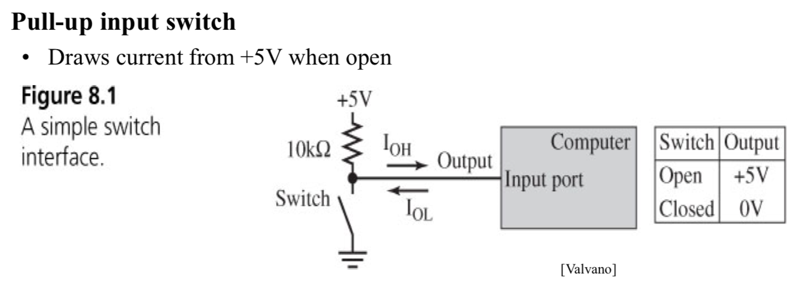
- Pull-down (internal resistor connected to Ground)  
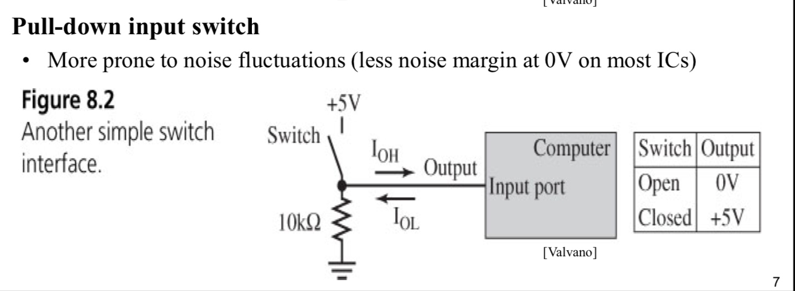
#### GPIO Output Mode
- Push-Pull: the two transistor are connected to the GPIO pin, and one is connected with VCC, another is with GND. By control the transistor, we can drive the GPIO to low voltage level or high voltage level
- Open drain: one transistor connect the GPIO pin with GND. if we want to drive it to high voltage level, we need to connect the a pull up resistor with GPIO.  

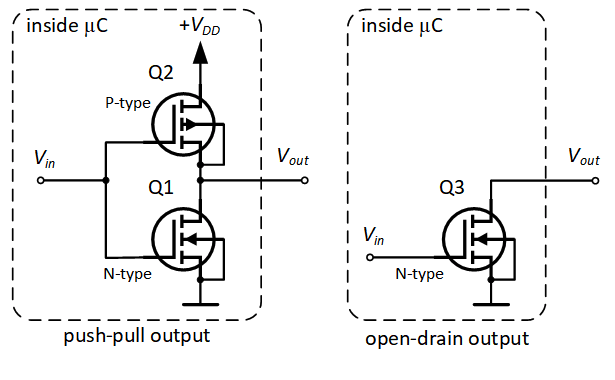

#### Switch Bounce

Switch have mechanical contacts.
- Them take time to move position
- Take time to stabilize when open or closing
- Create sparks on GPIO input pin

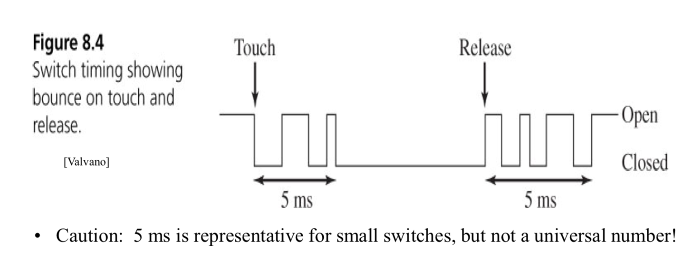

#### Hardware Debounce

- connect the GPIO with capacitor
- Add Schmitt-Trigger Inverters

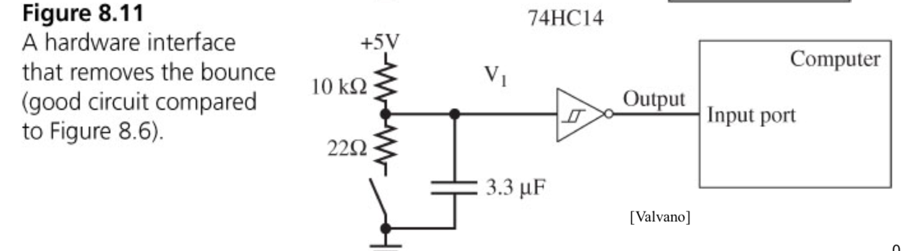
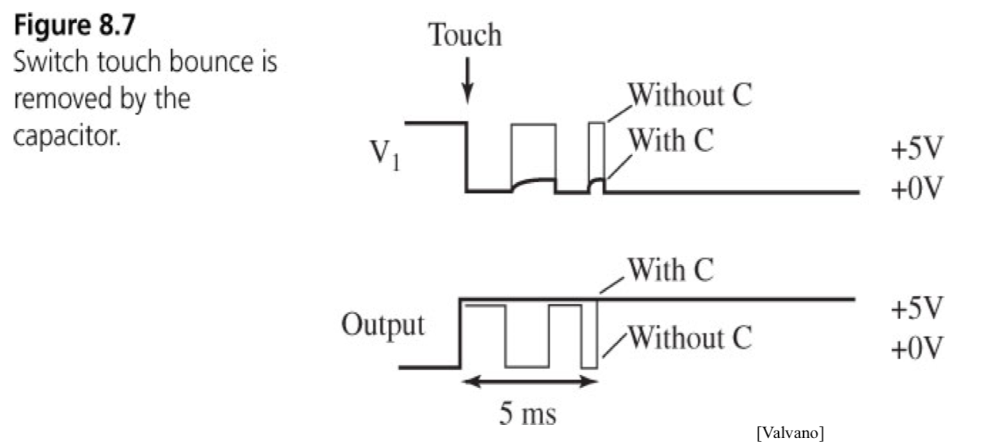
#### Software Debounce

- wait for the switch value is steady for 10 ms

#### Using GPIO control the LED 

### Memory Mapped IO
Memory-mapped I/O uses the same **address space** to address both memory and I/O devices. The memory and registers of the I/O devices are mapped to (associated with) address values. So when an address is accessed by the CPU, it may refer to a portion of physical RAM, or it can instead refer to memory of the I/O device. Thus, the CPU instructions used to access the memory can also be used for accessing devices. 

Port-mapped I/O :I/O devices have a separate address space from general memory, either accomplished by an extra "I/O" pin on the CPU's physical interface, or an entire bus dedicated to I/O.  Uses a special class of CPU instructions to access I/O devices 
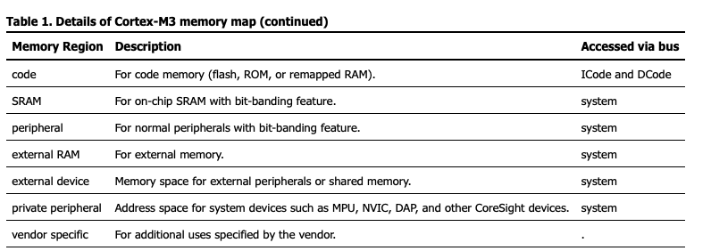
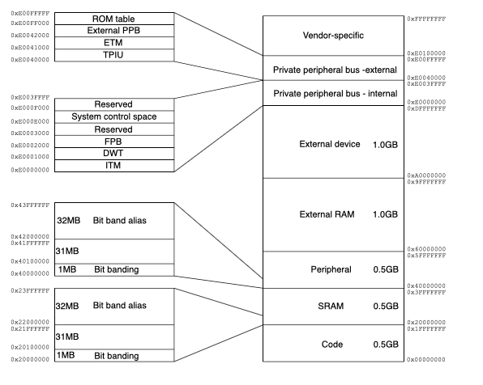

### Timer

#### Watch Dog timer

The watch dog timer is used to avoid the program go stuck. The timer will reset the CPU when it reach zero. So you micro controller have reset the timer frequently to show that the program runs correctly

Usage:
- detect the software hangs
  - could be in a infinite loop
  - wild pointer 
  - corrupted data

Basic Idea:
- Have a hardware timer running all the time (count-down timer)
- When timer reaches zero, it resets the system
- Software periodically “kicks” (or “pets”) the watchdog, restarting the count
- It means the system is really alive
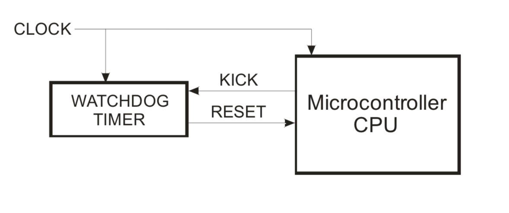

### Interrupt

There are two kinds of interrupt, software and hardware.
- software: 
  - instruction with code cause a interrupt
  - SWI has to be placed as an explicit instruction at a specific location ...
    a synchronous interrupt – happens synchronized to program flow
- hardware:
  - Hardware interrupt causes CPU to execute a virtual interrupt instruction
  - Save current state of the CPU on the stack
  - Execute Interrupt Service Routine
  - Acknowledge the Interrupt (Clear the interrupt flag)
  - Resume execution

### ARM ISA
- General purpose register R0 - R12 
- Special purpose: 
  - Stack pointer: points to the top of the stack 
  - Link register: store the return addr when a subroutine call is made 
  - Program counter: incremented by the size of the instruction executed (which is always four bytes in ARM state). Branch instructions load the destination address into PC. During execution, PC stores the address of the current instruction plus 8 (two ARM instructions) in ARM state, and the current instruction plus 4 (two Thumb instructions) in Thumb(v1) state. 
  - Application program status register: holds the program status flags that are accessible in any processor mode. 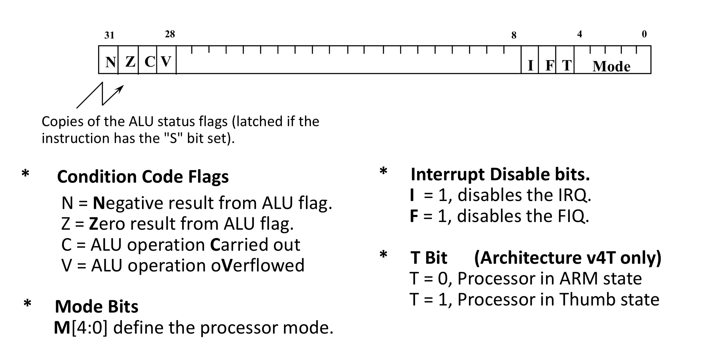 

### DMA (Direct Memory Access)
Direct memory access (DMA) is an interfacing technique that allows data to transfer directly from I/O device to memory, or from memory to the I/O device without going through the processor. Embedded system designers will need to use DMA when interfacing high speed devices.

- CPU need setup destination address, source addres, data size, and send the transfer request.
- DMA need request for getting the
- When the DMA finish transmission, it will send a interrupt to notify CPU. 

### RTOS

#### Priority Inversion

The priority Inversion
- Usually happens when high priority task and low priroity task share the same lock
- The low priority task C share the resource with high priority task A
- When the low priority task C grab the lock, but the high priority task A also want to grab the lock, it will fail and be blocked
- If in this situation, we have another task B which has higher priority than task C. It will run firstly and block task C.
- Now you can see, the order of three task runs are B C A. Now the A with highest priority actually is the last task to run. 

#### Priority Inheritance
- When the C grab the lock that  A want to grab. the priority of A will be assigned to C.
- Now the order of running is C A B

### CAN Bus

Message Format

### Bit Banging

### Peripheral Communication

**Framing Message** solve the problem of know how many bytes to receive
- Header info – what type of message is this?
- [optional] – count of how many bytes to expect
- Payload – the actual data you care about
- Error detection – something beyond parity to detect corrupted bytes
- Each message might also be sandwiched between an XON and XOFF
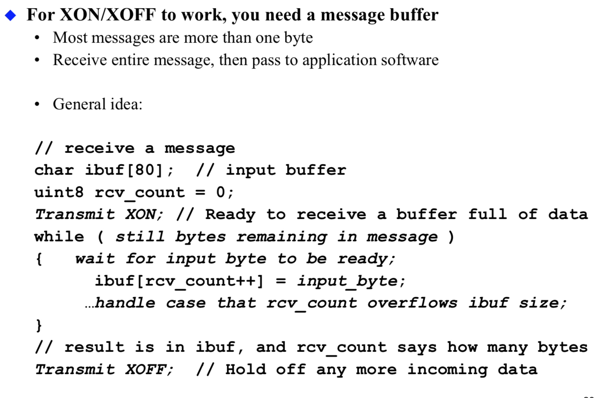

#### SPI

You might be thinking to yourself, self, that sounds great for one-way communications, but how do you send data back in the opposite direction? Here's where things get slightly more complicated.

In SPI, only one side generates the clock signal (usually called CLK or SCK for Serial ClocK). The side that generates the clock is called the "master", and the other side is called the "slave". There is always only one master (which is almost always your microcontroller), but there can be multiple slaves (more on this in a bit).

When data is sent from the master to a slave, it's sent on a data line called MOSI, for "Master Out / Slave In". If the slave needs to send a response back to the master, the master will continue to generate a prearranged number of clock cycles, and the slave will put the data onto a third data line called MISO, for "Master In / Slave Out".

Notice we said "prearranged" in the above description. Because the master always generates the clock signal, it must know in advance when a slave needs to return data and how much data will be returned. This is very different than asynchronous serial, where random amounts of data can be sent in either direction at any time. In practice this isn't a problem, as SPI is generally used to talk to sensors that have a very specific command structure. For example, if you send the command for "read data" to a device, you know that the device will always send you, for example, two bytes in return. (In cases where you might want to return a variable amount of data, you could always return one or two bytes specifying the length of the data and then have the master retrieve the full amount.)

Note that SPI is "full duplex" (has separate send and receive lines), and, thus, in certain situations, you can transmit and receive data at the same time (for example, requesting a new sensor reading while retrieving the data from the previous one). Your device's datasheet will tell you if this is possible.

#### I2C

1. Basics
Messages are broken up into two types of frame: an **address frame**, where the master indicates the slave to which the message is being sent, and one or more **data frames**, which are 8-bit data messages passed from master to slave or vice versa. Data is placed on the SDA line after SCL goes low, and is sampled after the SCL line goes high. The time between clock edge and data read/write is defined by the devices on the bus and will vary from chip to chip.

2. Start Condiction
To initiate the address frame, the master device **leaves SCL high and pulls SDA low.** This puts all slave devices on notice that a transmission is about to start. If two master devices wish to take ownership of the bus at one time, whichever device pulls SDA low first wins the race and gains control of the bus. It is possible to issue repeated starts, initiating a new communication sequence without relinquishing control of the bus to other masters; we'll talk about that later.

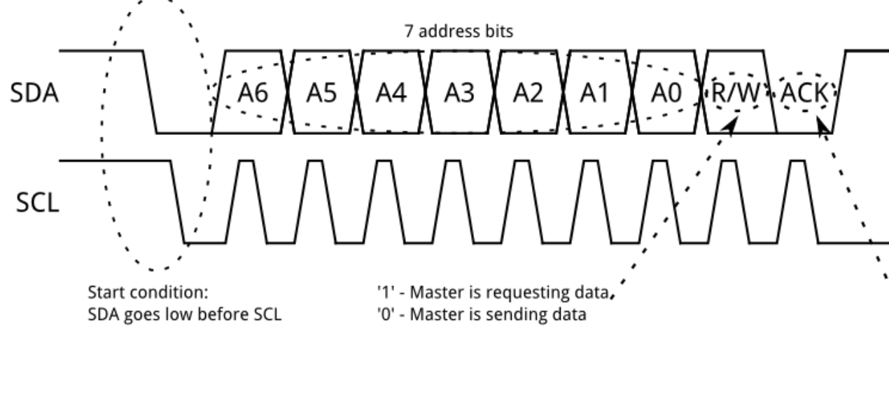

3. Address Frame
The address frame is always first in any new communication sequence. For a 7-bit address, the address is clocked out most significant bit (MSB) first, followed by a R/W bit indicating whether this is a read (1) or write (0) operation.
The 9th bit of the frame is the NACK/ACK bit. This is the case for all frames (data or address). Once the first 8 bits of the frame are sent, the receiving device is given control over SDA. If the receiving device does not pull the SDA line low before the 9th clock pulse, it can be inferred that the receiving device either did not receive the data or did not know how to parse the message. In that case, the exchange halts, and it's up to the master of the system to decide how to proceed.

4. Data Frame
After the address frame has been sent, data can begin being transmitted. The master will simply continue generating clock pulses at a regular interval, and the data will be placed on SDA by either the master or the slave, depending on whether the R/W bit indicated a read or write operation. The number of data frames is arbitrary, and most slave devices will auto-increment the internal register, meaning that subsequent reads or writes will come from the next register in line.
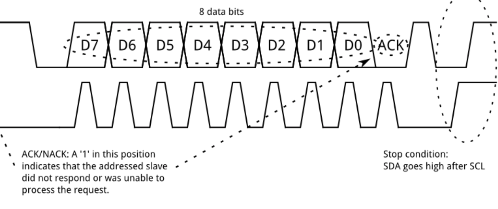

5. Stop Condition
Once all the data frames have been sent, the master will generate a stop condition. Stop conditions are defined by a 0->1 (low to high) transition on SDA after a 0->1 transition on SCL, with SCL remaining high. During normal data writing operation, the value on SDA should not change when SCL is high, to avoid false stop conditions.

6. Repeated Start Condition
it is important that a master device be allowed to exchange several messages in one go, without allowing other master devices on the bus to interfere. For this reason, the repeated start condition has been defined.
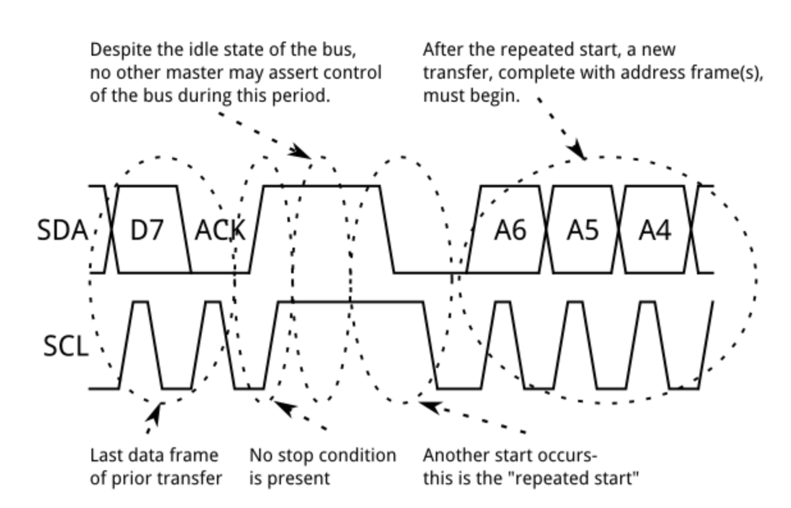

7. Clock Stretching
the master's data rate will exceed the slave's ability to provide that data. This can be because the data isn't ready yet (for instance, the slave hasn't completed an analog-to-digital conversion yet) or because a previous operation hasn't yet completed (say, an EEPROM which hasn't completed writing to non-volatile memory yet and needs to finish that before it can service other requests).
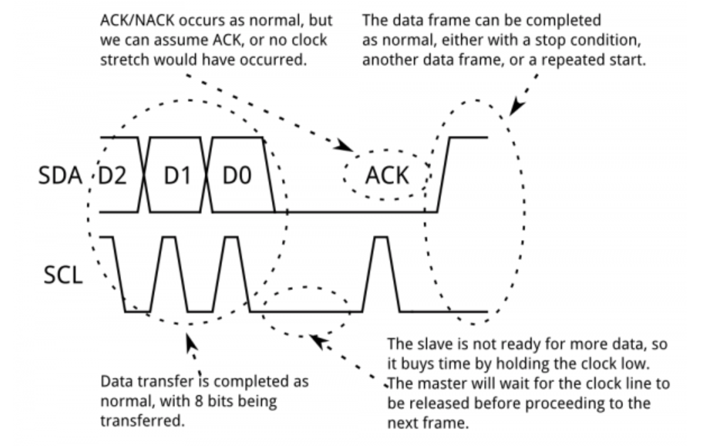

#### Serial Communication

1. Hardware UART
A universal asynchronous receiver/transmitter (UART) is a block of circuitry responsible for implementing serial communication. Essentially, the UART acts as an intermediary between parallel and serial interfaces. On one end of the UART is a bus of eight-or-so data lines (plus some control pins), on the other is the two serial wires - RX and TX.
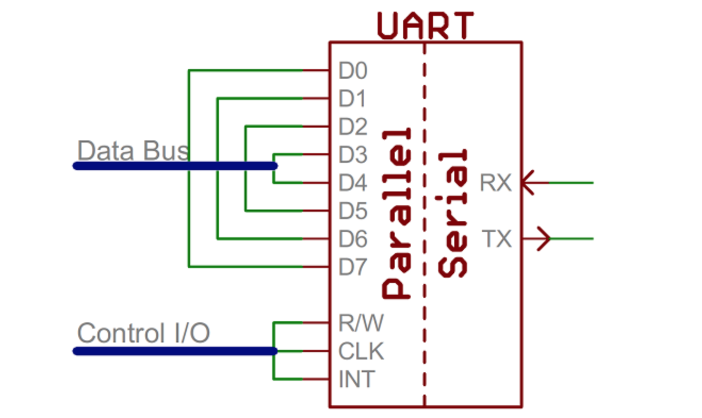
UART transmitted data is organized into packets. Each packet contains 1 start bit, 5 to 9 data bits (depending on the UART), an optional parity bit, and 1 or 2 stop bits:
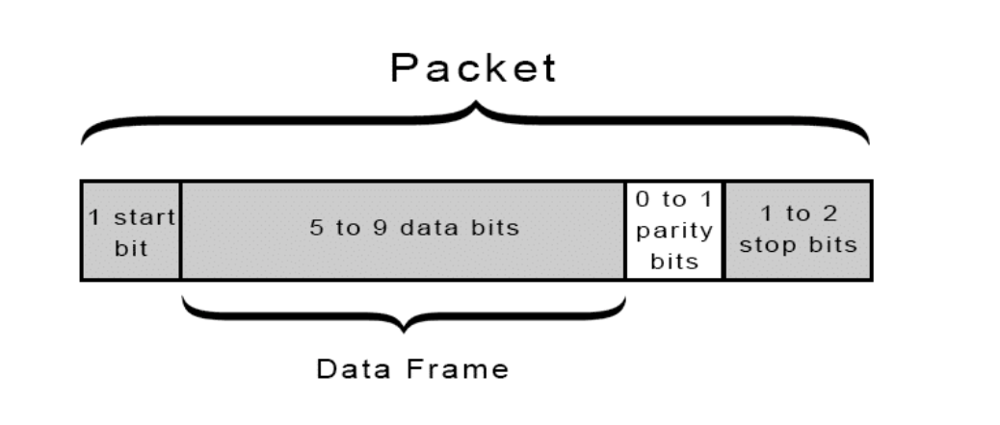
In most cases, the data is sent with the **least significant bit first**.

- **start bit**
  - The UART data transmission line is normally held at a high voltage level when it’s not transmitting data. 
  - To start the transfer of data, the transmitting UART pulls the transmission line from high to low for one clock cycle. 
  - When the receiving UART detects the high to low voltage transition, it begins reading the bits in the data frame at the frequency of the baud rate. 
- **data bits**
  - actual data
- **parity bit**
  - Parity describes **the evenness or oddness of a number**. The parity bit is a way for the receiving UART to tell if any data has changed during transmission.
  - If the parity bit is a 0 (even parity), the 1 bits in the data frame should total to an even number. 
  - If the parity bit is a 1 (odd parity), the 1 bits in the data frame should total to an odd number.
- **stop bit**
  - To signal the end of the data packet, the sending UART drives the data transmission line from a low voltage to a high voltage for at least two bit durations.

2. Software UARTs
If a microcontroller doesn't have a UART (or doesn't have enough), the serial interface can be bit-banged - directly controlled by the processor. This is the approach Arduino libraries like SoftwareSerial take. **Bit-banging** is **processor-intensive**, and not usually as precise as a UART, but it works in a pinch!

3. Hardware Flow Control
- "RTS" : I am ready to send bits
- "CTS" " OK, I am readyto receive bits - send them
- CTS goes high after every byte, then goes low again for the next byte
- make sure CPU can get byte out of input buffer in time

4. Framing Message
Solve the problem of know how many bytes to receive
- Header info – what type of message is this?
- [optional] – count of how many bytes to expect
- Payload – the actual data you care about
- Error detection – something beyond parity to detect corrupted bytes
- Each message might also be sandwiched between an XON and XOFF

### Asynchronous system design

#### Receive the data from serial port asynchronously

- The serial port interrupt will be triggered byte by byte
- When the interrupt was triggered, it will set the oneshot time to start
- When the timer times out, it will grab the data stored in the serial port buffer