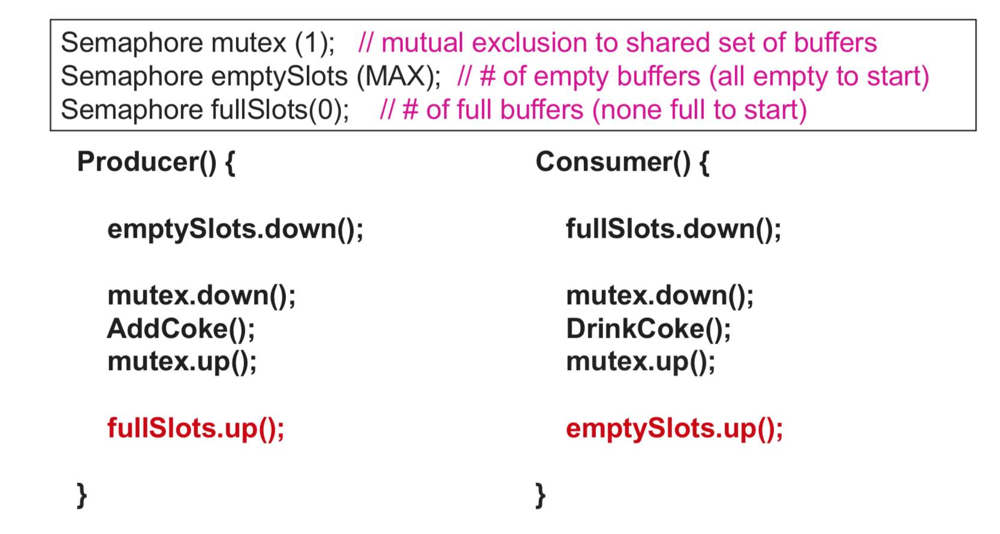
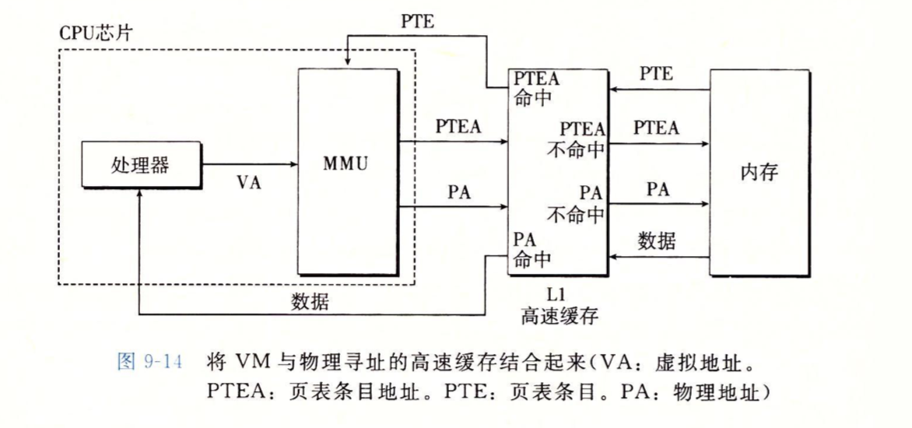
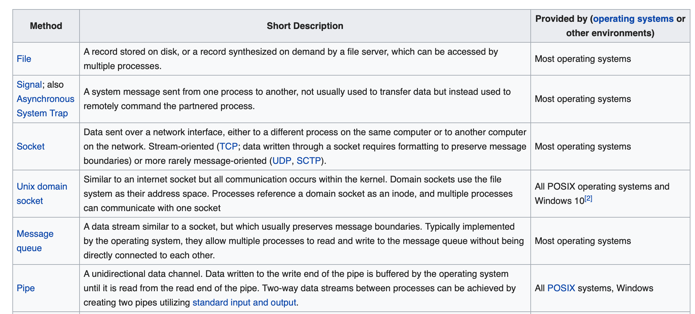

[Goback to Readme](./readme.md)

- [Operating System](#operating-system)
  - [Deadlock](#deadlock)
  - [Thread Control Block](#thread-control-block)
  - [Process vs Thread](#process-vs-thread)
  - [Thread Synchronization](#thread-synchronization)
  - [Producer and Consumer](#producer-and-consumer)
  - [Paging](#paging)
    - [Virtual Memory](#virtual-memory)
  - [Inter Process Communication](#inter-process-communication)

## Operating System

### Deadlock
- Mutual Exclusion: One or more than one resource are non-sharable (Only one process can use at a time)
- Hold and Wait: A process is holding at least one resource and waiting for resources.
- No Preemption: A resource cannot be taken from a process unless the process releases the resource.
- Circular Wait: A set of processes are waiting for each other in circular form.

### Thread Control Block
- Thread Identifier: Unique id (tid) is assigned to every new thread
- Stack pointer: Points to thread's stack in the process
- Program counter: Points to the current program instruction of the thread
- State of the thread (running, ready, waiting, start, done)
- Thread's register values
- Pointer to the Process control block (PCB) of the process that the thread lives on

The blow shoe the different states of thread

### Process vs Thread
- Threads are not independent of one other like processes as a result threads shares with other threads their code section, data section and OS resources like open files and signals. But, like process, a thread has its own program counter (PC), a register set, and a stack space.
- Processes start out with a single main thread. The main thread can create new threads using a thread fork system call. The new threads can also use this system call to create more threads. Consequently, a thread not only belongs to a process; it also has a parent thread - the thread that created it.

### Thread Synchronization
Locks:
- spin lock
  - With a spinlock, the thread simply waits ("spins") until the lock becomes available. This is efficient if threads are blocked for a short time, because it avoids the overhead of operating system process re-scheduling. 
  - It is inefficient if the lock is held for a long time, or if the progress of the thread that is holding the lock depends on preemption of the locked thread.
- mutex
  - provide mutual exclusion for the resources, and it will block the thread if the resrouce is no availble. CPU would reschedule the thread when the lock is available.

Semaphores:
- counting semaphore
  - Every time you wait on a semaphore, you decrease the current count. 
  - If the count was greater than zero then the decrement just happens, and the wait call returns. 
  - If the count was already zero then it cannot be decremented, so the wait call will block until another thread increases the count by signalling the semaphore.
  - Every time you release a semaphore, you increase the current count.
  - If the count was zero before you called signal, and there was a thread blocked in wait then that thread will be woken. If multiple threads were waiting, only one will be woken
  - If the count was already at its maximum value then the signal is typically ignored, although some semaphores may report an error.

- binary semaphore
  - it is pretty much similar to the mutex

### Producer and Consumer
This is the template for the producer and consumer models in Operating System, it uses the semaphore and mutext to protect resources like ring buffer

### Paging 
Paging is a memory management scheme that eliminates the need for contiguous allocation of physical memory. This scheme permits the physical address space of a process to be non – contiguous.

Pages has two states: **valid** and **resident**.

**Valid** means the page are allocated to the program, and it is legal for the process to access.

**Redident** means the page are already in the physical memory.

Page size usually 4KB or 8KB

#### Virtual Memory

### Inter Process Communication
Inter process communication (IPC) is a mechanism which allows processes to communicate each other and synchronize their actions. 
The communication between these processes can be seen as a method of co-operation between them. Processes can communicate with each other using these two ways:
1. Shared Memory
2. Message passing
