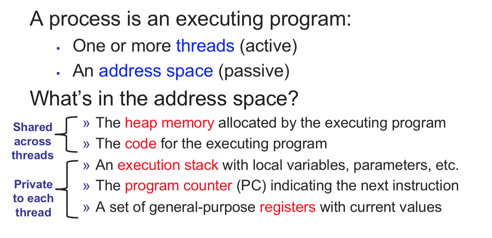

[Goback to Readme](./readme.md)

- [Operating System](#operating-system)
  - [Scheduling](#scheduling)
  - [Deadlock](#deadlock)
  - [Process Control Block](#process-control-block)
  - [Thread Control Block](#thread-control-block)
  - [Process vs Thread](#process-vs-thread)
  - [Thread Synchronization](#thread-synchronization)
  - [Producer and Consumer](#producer-and-consumer)
  - [Paging](#paging)
    - [Virtual Memory](#virtual-memory)
  - [Inter Process Communication](#inter-process-communication)

## Operating System

### Scheduling
In order to maximize the reponse time of each thread and the system throughput. We need scheduler to schedule the thread with different algorithm.

We want to avoid the starvation happens
- 

### Deadlock
- Mutual Exclusion: One or more than one resource are non-sharable (Only one process can use at a time)
- Hold and Wait: A process is holding at least one resource and waiting for resources.
- No Preemption: A resource cannot be taken from a process unless the process releases the resource.
- Circular Wait: A set of processes are waiting for each other in circular form.

### Process Control Block
Process control information is used by the OS to manage the process itself. This includes:

- The process scheduling state: The state of the process in terms of "ready", "suspended", etc., and other scheduling information as well, like priority value, the amount of time elapsed since the process gained control of the CPU or since it was suspended. Also, in case of a suspended process, event identification data must be recorded for the event the process is waiting for.
- Process structuring information: process's children id's, or the id's of other processes related to the current one in some functional way, which may be represented as a queue, a ring or other data structures.
- Interprocess communication information: various flags, signals and messages associated with the communication among independent processes may be stored in the PCB.
- Process Privileges in terms of allowed/disallowed access to system resources.
- Process State: State may enter into new, ready, running, waiting, dead depending on CPU scheduling.
- Process Number (PID): A unique identification number for each process in the operating system (also known as Process ID).
- Program Counter (PC): A pointer to the address of the next instruction to be executed for this process.
- CPU Registers: Indicates various register set of CPU where process need to be stored for execution for running state.
- CPU Scheduling Information: indicates the information of a process with which it uses the CPU time through scheduling.
- Memory Management Information: includes the information of **page table**, memory limits, Segment table depending on memory used by the operating system.
- Accounting Information: Includes the amount of CPU used for process execution, time limits, execution ID etc.
- I/O Status Information: Includes a list of I/O devices allocated to the process.

### Thread Control Block
- Thread Identifier: Unique id (tid) is assigned to every new thread
- Stack pointer: Points to thread's stack in the process
- Program counter: Points to the current program instruction of the thread
- State of the thread (running, ready, waiting, start, done)
- Thread's CPU register values
- Pointer to the Process control block (PCB) of the process that the thread lives on

The blow shoe the different states of thread

### Process vs Thread
- Threads are not independent of one other like processes as a result threads shares with other threads their code section, data section and OS resources like open files and signals. But, like process, a thread has its own program counter (PC), a register set, and a stack space.
- Processes start out with a single main thread. The main thread can create new threads using a thread fork system call. The new threads can also use this system call to create more threads. Consequently, a thread not only belongs to a process; it also has a parent thread - the thread that created it.

### Thread Synchronization
Locks:
- spin lock
  - With a spinlock, the thread simply waits ("spins") until the lock becomes available. This is efficient if threads are blocked for a short time, because it avoids the overhead of operating system process re-scheduling. 
  - It is inefficient if the lock is held for a long time, or if the progress of the thread that is holding the lock depends on preemption of the locked thread.
- mutex
  - provide mutual exclusion for the resources, and it will block the thread if the resrouce is no availble. CPU would reschedule the thread when the lock is available.

Semaphores:
- counting semaphore
  - Every time you wait on a semaphore, you decrease the current count. 
  - If the count was greater than zero then the decrement just happens, and the wait call returns. 
  - If the count was already zero then it cannot be decremented, so the wait call will block until another thread increases the count by signalling the semaphore.
  - Every time you release a semaphore, you increase the current count.
  - If the count was zero before you called signal, and there was a thread blocked in wait then that thread will be woken. If multiple threads were waiting, only one will be woken
  - If the count was already at its maximum value then the signal is typically ignored, although some semaphores may report an error.

- binary semaphore
  - it is pretty much similar to the mutex

### Producer and Consumer
This is the template for the producer and consumer models in Operating System, it uses the semaphore and mutext to protect resources like ring buffer

### Paging 
Paging is a memory management scheme that eliminates the need for contiguous allocation of physical memory. This scheme permits the physical address space of a process to be non – contiguous.

Pages has two states: **valid** and **resident**.

**Valid** means the page are allocated to the program, and it is legal for the process to access.

**Redident** means the page are already in the physical memory.

Page size usually 4KB or 8KB

Page Faults: when a process tries to reference a page not currently present in RAM, the processor treats this invalid memory reference as a page fault and transfers control from the program to the operating system.

OS Hanlding Page Faults:
- Determine the location of the data on disk.
- Obtain an empty page frame in RAM to use as a container for the data.
- Load the requested data into the available page frame.
- Update the page table to refer to the new page frame.
- Return control to the program, transparently retrying the instruction that caused the page fault.

Thrashing: 
- thrashing occurs when a computer's virtual memory resources are overused, leading to a constant state of paging and page faults, inhibiting most application-level processing. A lots of code are using their address space actively
- Solution:
  - Increase the DRAM
  - Run fewer processes
    - reduce the page faults

#### Virtual Memory

### Inter Process Communication
Inter process communication (IPC) is a mechanism which allows processes to communicate each other and synchronize their actions. 
The communication between these processes can be seen as a method of co-operation between them. Processes can communicate with each other using these two ways:
1. Shared Memory
2. Message passing
